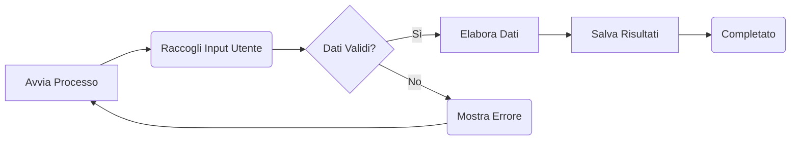
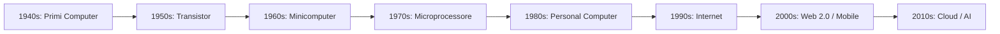

<!-- markdownlint-disable MD033 MD026-->
### 🧑‍🏫 Professore - Tecnologie informatiche

### Buongiorno, a tutti! Io mi chiamo Bonfiglio Fabrizio

Memorizza l'[Uniform Resource Locator Kit bit.ly/m/TI](https://bit.ly/m/TI) un menu di riferimento per tutto l'anno scolastico

### Da oggi, organizziamoci in 2 gruppi di squadre speciali

- Il gruppo Studenti
- Il guppo Omarillos, neuroni di intelligenza naturale

### Gruppo Omarillos, presentarvi e spiegate cosa farete?

#### Ma ora, andiamo a esplorare cosa faremo insieme!

---
level: 3
title: Welcome
layout: image-right
image: /menu.png

---

### 🧠 Omarillo - Neurone di Intelligenza Naturale

#### Certamente, Professore! Salve a tutti, io sono un Omarillo

#### Il nostro compito è stimolare l'apprendimento e la curiosità dei nostri coetanei, contaminandoli con la passione per la conoscenza

#### Vi aiuteremo a comprendere i concetti complessi delle tecnologie Informatiche in modo semplice e speriamo divertente🌟

#### Curiosi! Vi parleremo ora dei contenuti del nostro sito, URL:[omarillo.itomar.it](http://omarillo.itomar.it)

 Questo sito è una risorsa incompleta per chi vuole approfondire la conoscenza delle tecnologie informatiche e dei sistemi digitali dovrà esaminare molto di più.

---
layout: cover
level: 3
title: Welcome

---

### 🧑‍🎓 Studente-1

## Ciao Omarillo! Ma allora cosa tratta il sito?



---
layout: cover
level: 3
title: Welcome

---

### 🧠 Omarillo-1

### Il sito è suddiviso in diverse sezioni che coprono vari argomenti fondamentali dell'informatica. Ecco una panoramica:

1. **Architettura dei Computer**: Spiega i componenti principali di un computer, come la CPU, la memoria e i dispositivi di input/output. Descrive anche l'architettura a livelli e il funzionamento della pipeline della CPU.

2. **Sistemi Operativi**: Dettaglia i compiti di un sistema operativo, come la gestione dei processi, della memoria e delle risorse. Discute anche delle differenze tra vari sistemi operativi, come Linux e Windows.

3. **Programmazione e Algoritmi**: Introduce i concetti di programmi, algoritmi e problemi. Spiega come scrivere e ottimizzare codice, e fornisce esempi di algoritmi comuni.

4. **Sistemi di Numerazione**: Spiega i sistemi di numerazione, in particolare il sistema binario, che è fondamentale per comprendere il funzionamento dei computer.

5. **Reti di Computer**: Fornisce una panoramica delle reti di computer, dei protocolli di comunicazione e della sicurezza delle reti.

---
layout: cover
title: Virtualizzazione, concorrenza e persistenza.
level: 3
background: <https://vidabytes.com/wp-content/uploads/2021/05/Programas-para-crear-m%C3%A1quinas-virtuales-4-1024x614.jpg>

---

### 🧑‍🎓 Studente-12

## Troppe cose da imparare!!

## E io tutto questo dovrò studiare ?

### 🧠 Omarillo-12
<!--
https://github.com/rnatella/so_esempi/
https://github.com/remzi-arpacidusseau
https://pages.cs.wisc.edu/~remzi/OSTEP/
-->
## Già ! Ma da solo tre idee chiave fatti guidare!

## Ed ogni verifica riuscirai ad affrontare.

### 🧑‍🎓 Studente-11

## Allora c'è qualcuno che me le vuole raccontare ?

---
layout: cover
title: Virtualizzazione, concorrenza e persistenza.
level: 3

---

### 🧠 Omarillo5

**Allora Eccoti la tripla chiave**

## 🔑1 Virtualizzazione

## 🔑2 Concorrenza

## 🔑3 Persistenza

Imparando queste idee, imparerai tutto su come funziona un sistema operativo, incluso come decide quale programma eseguire successivamente su una CPU, come gestisce il sovraccarico di memoria  **sistema memoria virtuale** , come funzionano i monitor delle macchine virtuali, come gestire le informazioni sui dischi, e anche un po' su come costruire un sistema distribuito che funzioni quando alcune parti sono guaste. Quel genere di cose.

---
layout: cover
level: 3
title: Welcome

---

## 🧑‍🎓 Studente-3

## Non ho idea di cosa tu stia parlando, davvero!!

## 🧑 Professore

## Bene! Questo significa che sei nella classe giusta

## 🧑‍🎓 Studente-7

## Io ho una domanda: qual è il modo migliore per imparare queste cose?

---
layout: cover
level: 3
title: Welcome

---

### 🧠 Omarillo -7

#### Eccellente domanda!

### Beh, ogni persona deve capirlo da sola, ovviamente.

## Ma ecco cosa farei io: ascoltare lezione che introduce il materiale e segnarmi delle personali osservazioni su un quaderno dedicato a quadretti.

## Poi, alla fine di ogni settimana, leggo questi appunti, per aiutare le idee ad affondare un po' meglio nella mia testa.

---
layout: cover
level: 3
title: Welcome

---

### 🧠 Omarillo -6

## Già affondare nella testa non galleggiare. 🧠

## Naturalmente, un po' di tempo dopo (suggerimento: la settimana prima della verifica! 📅), rileggere gli appunti per consolidare le tue conoscenze. 📚

## Naturalmente, il tuo professore assegnerà sicuramente alcuni compiti e progetti, quindi dovresti farli. 📝

---
layout: cover
level: 3
title: Welcome

---

### 🧠 Omarillo -10

## In particolare, fare esercizi in cui scrivi e ti applichi per risolvere problemi reali è il modo migliore per mettere in pratica le idee contenute in questi appunti.

## Come disse Confucio...

---
layout: cover
level: 3
title: Welcome

---

## 🧑‍🎓  👂 👁 ✋ Studente-8

## Oh, lo so!

## "Sento e dimentico. Vedo e ricordo. Faccio e capisco."

O qualcosa del genere.

- Orecchio: 👂
- Occhio: 👁
- Mano: ✋

### 🧑‍🏫 Professore (sorpreso)

## Come hai fatto a sapere cosa stavamo per dire?!

### 🧑‍🎓 Studente-4

Sono un grande fan di Confucio, e un fan ancora più grande di Xunzi, che in realtà è una fonte migliore per questa citazione.

---
layout: cover
level: 3
title: Welcome

---

## Confucio (孔子) e Xunzi (荀子)

<div class="scrollable">

Confucio (孔子) e Xunzi (荀子) sono due delle figure più importanti nella storia del pensiero cinese, entrambe associate alla scuola confuciana.

Tuttavia, le loro visioni del mondo e della natura umana differiscono significativamente.

### Confucio (551-479 a.C.)

Confucio, noto anche come Kongzi o Kong Fuzi, è il fondatore della scuola confuciana.

La sua filosofia è centrata su concetti come l'umanità (ren), la giustizia (yi), la correttezza rituale (li), la saggezza (zhi) e la sincerità (xin). Alcuni dei punti chiave della filosofia di Confucio includono:

1. **Ren (仁)**: La benevolenza o umanità. È il principio centrale della moralità e delle relazioni umane.
2. **Li (礼)**: Le pratiche rituali e le norme di comportamento, che regolano le interazioni sociali.
3. **Junzi (君子)**: L'uomo nobile o il gentiluomo, che segue i principi morali e le virtù.
4. **Educazione**: Confucio credeva fermamente nell'importanza dell'educazione e dell'auto-coltivazione per diventare una persona virtuosa.

### Xunzi (ca. 310-235 a.C.)

Xunzi, conosciuto anche come Xun Kuang, è stato un importante esponente della scuola confuciana, ma con una visione molto più pessimista della natura umana rispetto a Confucio e Mencio (altro importante pensatore confuciano).

Alcuni punti salienti del pensiero di Xunzi includono:

1. **Natura Umana**: Xunzi credeva che la natura umana fosse intrinsecamente malvagia (性恶, xing'e) e che gli individui fossero inclini all'egoismo e alla competizione.
2. **Ruolo dell'Educazione**: Poiché la natura umana è malvagia, l'educazione e la cultura (wen) sono essenziali per trasformare e migliorare gli individui.
3. **Legge e Ordine**: Xunzi enfatizzava l'importanza delle leggi e delle istituzioni per mantenere l'ordine sociale e la moralità.
4. **Li (礼)**: Anche Xunzi attribuiva grande importanza ai rituali e alle norme di comportamento, ma li vedeva come strumenti necessari per controllare la natura umana.

### Differenze Chiave

- **Natura Umana**: Confucio vedeva la natura umana come fondamentalmente buona o neutrale, mentre Xunzi la vedeva come intrinsecamente malvagia.
- **Metodo di Miglioramento**: Per Confucio, l'auto-coltivazione e la pratica delle virtù erano sufficienti, mentre Xunzi riteneva necessarie le leggi e l'educazione rigorosa per trasformare la natura umana.
- **Ruolo dei Rituali**: Entrambi attribuivano importanza ai rituali, ma per Xunzi erano strumenti per mantenere l'ordine e controllare l'umanità, mentre per Confucio erano anche mezzi per esprimere e coltivare virtù.

### Similitudini

Nonostante le loro differenze, entrambi credevano nella possibilità del miglioramento umano attraverso l'educazione e vedevano il ruolo del governo come cruciale per il mantenimento dell'ordine e della moralità nella società.

In sintesi, mentre Confucio è più ottimista riguardo alla natura umana e al potere dell'auto-coltivazione, Xunzi adotta un approccio più pragmatico e severo, sottolineando la necessità di leggi e istituzioni rigorose per correggere la tendenza innata dell'uomo verso il male.

</div>

<style>
.scrollable {
  max-height: 300px; /* Altezza massima dell'area scrollabile */
  overflow-y: auto;  /* Abilita lo scroll verticale */
  padding: 1em;      /* Aggiungi un po' di padding */
  border: 1px solid #ccc; /* Aggiungi un bordo per evidenziare l'area scrollabile */
}
</style>

---
layout: cover
level: 3
title: Welcome

---

## 🧑‍🏫 Professore (sbalordito)

Beh, penso che andremo d'accordo benissimo! Benissimo davvero.

## 🧑‍🎓 Studente -3

## Professore, solo un'altra domanda, se posso.

A cosa servono questi dialoghi?

## Voglio dire, non dovrebbe esserci solo un libro?

## Perché non presentare il materiale direttamente?

---
layout: cover
level: 3
title: Welcome

---

## 🧑‍🏫 Professore

Ah, buona domanda, buona domanda!

Beh, penso che a volte sia utile tirarsi fuori da una narrazione e riflettere un po'; questi dialoghi sono quei momenti.

Quindi noi lavoreremo insieme per dare un senso a tutte queste idee piuttosto complesse.

Siete pronti?

---
layout: cover
level: 3
title: Welcome

---

## 🧑‍🎓 Studente-9

Quindi dobbiamo pensare? Beh, sono pronto per questo.

Voglio dire, cosa dovrei fare comunque?

Non è che abbia molta vita al di fuori di questo istituto.

---
layout: cover
level: 3
title: Welcome

---

## 🧑‍🎓 🧑‍🎓 🧑‍🎓 Studenti

## BHUUUUU!

## 🧠 🧠 🧠 🧠 Omarillos

## Neanche noi, purtroppo. Quindi mettiamoci al lavoro!

---
layout: cover
level: 3
title: Welcome

---

### 🧑‍🎓 Studente-2

## Sarà, non ho mai fatto lezioni così!

## Mi sembra tutto molto strano,  .. ma forse interessante!

## Possiamo ora approfondire la sezione sull'architettura dei computer?

---
layout: cover
level: 3
title: Origini
id: origini

---

### 🎭 **Dialogo: "Alle Origini dell'Informatica"**

*Luogo: Aula virtuale interattiva con pannelli olografici e timeline storiche animate.*


* **1940s:**
     Sviluppo dei primi computer elettronici digitali (es. ENIAC, Colossus).
     Concetto di programma memorizzato (von Neumann).
* **1950s:**
     Invenzione del **transistor** (cambia radicalmente l'elettronica).
     Nascita dei primi linguaggi di programmazione ad alto livello (FORTRAN, LISP).
* **1960s:**
     Sviluppo dei **minicomputer** (DEC PDP-1).
     Nascita di ARPANET (precursore di Internet).
     Invenzione del mouse e GUI (Douglas Engelbart).
* **1970s:**
     Invenzione del **microprocessore** (Intel 4004).
     Nascita del personal computer (Altair 8800).
     Sviluppo dei primi sistemi operativi (UNIX).
* **1980s:**
     Diffusione del **Personal Computer** (IBM PC, Apple Macintosh).
     Nascita del World Wide Web (Tim Berners-Lee al CERN).
     Linguaggi di programmazione come C++ e Perl.
* **1990s:**
     Esplosione di **Internet** e del World Wide Web.
     Browser web grafici (Mosaic, Netscape Navigator).
     Commercio elettronico.

---

* **2000s:**
     Avvento del **Web 2.0** (social media, blog).
     Diffusione degli **smartphone** e del computing mobile.
     Nascita del cloud computing.
* **2010s-Oggi:**
     Crescita esponenziale del **Cloud Computing** e dei Big Data.
     Avanzamento dell'**Intelligenza Artificiale** e del Machine Learning.
     Blockchain e criptovalute.
     IoT (Internet of Things).

**🤖 Omarillo 1**: Benvenuti, giovani menti curiose! Oggi vi guideremo attraverso un viaggio: dalle **pitture rupestri** ai **quantum computer**.

**👩‍🎓 Elena (Studente 1)**: Ma... l’informatica non è nata con i computer?

**🤖 Omarillo 2**: Non proprio, Elena. L’informatica nasce dal bisogno di **organizzare e tramandare l’informazione**.

**🧑‍🎓 Luca (Studente 2)**: Tipo la scrittura?

**🤖 Omarillo 3**: Esattamente! Scrivere era già un modo per **salvare dati**, come oggi facciamo su un disco una chiavetta USB o nel cloud.

---

### 📜 **Tappe storiche fondamentali**

**👩‍🎓 Giulia (Studente 3)**: Qual è stato il primo strumento “informatico”?

**🤖 Omarillo 4**: L’**abaco**! Introdotto nel XIII secolo a.C. in Cina: un calcolatore manuale!

**🧑‍🎓 Samir (Studente 4)**: Quindi… niente elettronica?

**🤖 Omarillo 5**: Ancora no. Poi arriva Pascal, nel 1642, con la **Pascalina**, che faceva addizioni e sottrazioni.

**👩‍🎓 Anna (Studente 5)**: Io ho letto di Leibniz. Che ha fatto lui?

**🤖 Omarillo 6**: Ha creato una macchina capace di **moltiplicare** e, soprattutto, ha proposto il **sistema binario**!

**🧑‍🎓 Leo (Studente 6)**: Binario? Come 0 e 1?

**🤖 Omarillo 7**: Sì! È la base dei computer moderni.

---

### 🧠 **La visione di Ada Lovelace**

**👩‍🎓 Sara (Studente 7)**: E Ada Lovelace? La prima programmatrice?

**🤖 Omarillo 8**: Corretto, Sara! Lavorò alla **Macchina Analitica** di Babbage, introducendo **concetti di programmazione**: cicli, condizioni, memoria.

**🧑‍🎓 Marco (Studente 8)**: All’epoca però non esistevano nemmeno i cavi elettrici…

**🤖 Omarillo 9**: Esatto, era tutto **meccanico**, ma il **pensiero computazionale** era già nato.

---

### ⚙️ **L’era dei computer**

**👩‍🎓 Yara (Studente 9)**: E quando arrivano i veri computer?

**🤖 Omarillo 10**: Durante la Seconda Guerra Mondiale. Il **Colossus**, guidato dalle idee di **Alan Turing**, serviva a **decifrare codici nazisti**.

**🧑‍🎓 Matteo (Studente 10)**: Poi l’ENIAC, giusto?

**🤖 Omarillo 11**: Sì! Nel 1946, era grande come una stanza e pesava 30 tonnellate!

**👩‍🎓 Chiara (Studente 11)**: E l’Italia? C’entra qualcosa?

**🤖 Omarillo 12**: Certamente. L’**Olivetti Programma 101**, tra il 1962 e 1964, fu uno dei primi **PC** veri e propri. Usato anche dalla **NASA**!

---

### 💡 **L’evoluzione e il futuro**

**🧑‍🎓 Davide (Studente 12)**: E oggi dove siamo arrivati?

**🤖 Tutti gli Omarilli (in coro)**:
Siamo nell’era del **quantum computing**, dell’**IA**, dell’**informatica ubiqua**!

**🤖 Omarillo 1**: Ma ricordate:
🔹 L’informatica non è solo hardware.
🔹 È anche **storia, logica, pensiero astratto**.
🔹 È il riflesso dell’uomo che **cerca di capire, ordinare e condividere la conoscenza**.

---

## Ipotesi di Chat Hackerate

Diverse situazioni possiamo riportare l'hacking di una chat dopo aver letto il libro da pag 5.

---

**Marco:** Ciao Laura! 👋 Stavo riflettendo su quanto l'informatica sia diventata... beh, onnipresente. È pazzesco come abbia cambiato tutto. 🤯

**Laura:** Ciao Marco! Verissimo! Pensa solo a come gestiamo le nostre case oggi. Con la **domotica** 🏠, posso accendere le luci o regolare il termostato con un'app sul telefono. E le auto? 🚗 Sono dei veri e propri computer su ruote, piene di sensori e connettività.

**Marco:** Già, il **pervasive computing** è proprio questo: sistemi informatici dappertutto, che quasi non ci accorgiamo di usarli. 👻 E i **dispositivi indossabili (wearable computing)**? Lo **smartwatch** ⌚ al polso è ormai la normalità, ti dice l'ora, le notifiche, monitora la salute... 💪

**Laura:** Esatto! Gli **smart glass** 👓 non sono ancora diffusi come gli orologi, ma chissà in futuro. Il bello è che siamo sempre connessi 🌐, possiamo comunicare con chiunque, ovunque. 🗣️🌍

---

### Realtà Aumentata e Realtà Virtuale

**Marco:** A proposito di futuro, mi affascina molto il discorso della **realtà aumentata (AR)**. L'idea di sovrapporre informazioni digitali al mondo reale è incredibile. ✨

**Laura:** Sì, è geniale! Hai presente quelle app sul telefono che usi per "vedere" come starebbe un mobile in salotto prima di comprarlo? 🛋️ Quella è AR pura. La fotocamera inquadra l'ambiente, e l'app ci aggiunge sopra l'immagine digitale del mobile. Oppure pensa a un magazzino, come nell'esempio del libro: puoi "colorare" le scatole sullo schermo del tablet per identificarle subito. 📦🎨

**Marco:** Capisco! Quindi sfrutta i sensori dello smartphone per capire dove sei e cosa stai guardando, e poi ti mostra i contenuti AR giusti. È come avere un livello extra di informazioni sulla realtà.  layers

**Laura:** Proprio così. E poi c'è la **realtà virtuale (VR)**, che è un passo oltre. Qui non si aggiunge nulla al mondo reale, lo si sostituisce proprio! 🚀

**Marco:** Ah, intendi i **visori VR**? 🕶️ Quelli che ti fanno immergere completamente in un ambiente digitale tridimensionale? 🏞️

---

**Laura:** Esattamente! Ti metti il visore e ti trovi catapultato in un'altra realtà. Ci sono programmi grafici incredibilmente sofisticati dietro. 💻🖼️ E molti visori hanno sensori che tracciano il movimento delle mani, così puoi interagire a 360 gradi con quell'ambiente virtuale. 🙌 È un'esperienza totalmente immersiva. 💫

**Marco:** Veramente impressionante. Sembra fantascienza, ma è già qui. 🤩 L'informatica di oggi non è solo velocità o potenza di calcolo, è anche come ci permette di percepire e interagire con il mondo in modi completamente nuovi. 🌍💡

**Laura:** Concordo in pieno! È eccitante pensare a cosa ci riserverà il futuro con queste tecnologie. 🔮

---

**🎓 Tutti gli Studenti**:
Grazie, Omarilli! Ora sappiamo che l’informatica è più umana di quanto pensassimo ma che cos'è un computer?

[!Mega Lezione di nonno Faggin](https://youtu.be/jQdFqQM540U)

---

## Che cos'è un Computer? Un Dialogo tra Esperti e Curiosi

**(La scena si apre in un'aula luminosa. I dodici Omarilli, esperti in vari campi dell'informatica, sono seduti di fronte a dodici studenti attenti e desiderosi di imparare.)**

---

**O1 (Professore):** Buongiorno a tutti! Oggi iniziamo dalle basi: **che cos'è un computer?** Spesso lo diamo per scontato, ma è un dispositivo davvero affascinante. In sostanza, un computer è un **dispositivo elettronico digitale** composto da due elementi fondamentali: **hardware e software**.

**S1:** Prof, scusi, ma cosa significa esattamente hardware e software? Li sento sempre nominare, ma faccio fatica a distinguerli bene.

**O4 (Esperto di Hardware):** Ottima domanda, S1! Con **hardware** intendiamo tutte le **parti fisiche, tangibili** di un computer. Immaginate lo schermo che state guardando, la tastiera che usate, o anche i circuiti elettronici interni che non vediamo. Sono tutte componenti che potete toccare.

**O3 (Ingegnere del Software):** E qui entro in gioco io! Il **software**, invece, è l'esatto contrario: è l'**insieme dei dati memorizzati e dei programmi** che fanno funzionare l'hardware. Non potete toccare un programma, ma è ciò che permette al computer di fare qualsiasi cosa, da scrivere un documento a navigare su internet.

**S6:** E il **firmware**, allora? Ho letto che esiste anche quello. È un software speciale?

**O9 (Progettista di Sistemi Embedded):** Bravo, S6! Il **firmware** è un tipo particolare di software, ma con una differenza chiave: è **installato dal costruttore** e non può essere cancellato facilmente. Pensateci come a un software "bloccato" che si occupa dei compiti basilari del sistema, come l'accensione del computer o la gestione di componenti specifici. È un po' il "cervello" primordiale che avvia tutto.

---

**O10 (Consulente IT):** In pratica, l'attività di un computer si riassume in tre fasi principali: **input, elaborazione e output**.

**S5:** Può farci un esempio pratico?

**O10:** Certo! Se scrivete una lettera con la tastiera, quella è la **fase di input** ⌨️. I dati, le lettere che digitate, vengono immessi nel computer. Poi, il computer lavora su quelle informazioni, le processa internamente: questa è la **fase di elaborazione** 🧠. Infine, quando vedete le parole apparire sullo schermo o le stampate, quella è la **fase di output** 📄: il computer vi restituisce il risultato.

**O11 (Architetto di Rete):** E non dimentichiamo che a queste fasi si aggiungono quelle di **memorizzazione** (salviamo i nostri file) e di **condivisione o distribuzione dei dati in rete** 🌐. Oggi è fondamentale poter accedere alle informazioni ovunque e condividerle.

---

### L'Elaborazione e l'Intelligenza Artificiale

**S10:** Quindi, l'elaborazione avviene sempre grazie al **processore**?

**O7 (Web Developer):** Principalmente sì, il processore è il "motore" che esegue i programmi. Ma l'informatica è in continua evoluzione, e stiamo assistendo a **nuovi metodi di elaborazione basati sull'Intelligenza Artificiale (IA)**. 🤖

**S4:** L'IA! È la parte che mi interessa di più! Le macchine possono davvero fare cose simili agli umani?

**O2 (Ricercatore in Intelligenza Artificiale):** Assolutamente! L'IA permette alle macchine di svolgere compiti che tradizionalmente richiedevano intelligenza umana. Pensate ai sistemi di **guida autonoma** 🚗, ai **robot di interpretazione o traduzione simultanea** 🗣️. Dietro ci sono algoritmi di IA molto complessi.

---

**S12:** Ma come fanno i computer a "imparare"? È come il nostro cervello?

**O2:** È una buona analogia! Gran parte degli algoritmi di IA si basa sul **Deep Learning**, un metodo di apprendimento automatico che sfrutta le **reti neurali artificiali**. Queste reti sono ispirate al funzionamento del nostro sistema nervoso, insegnando ai computer a elaborare i dati in modo simile.

**S9:** Ho sentito parlare di **Machine Learning**. È la stessa cosa del Deep Learning?

---

**O6 (Data Scientist):** Ottima domanda! Il **Machine Learning** è un campo più ampio, che include il Deep Learning. Il Machine Learning viene usato in molte applicazioni quotidiane: i filtri anti-spam della vostra posta elettronica 📧, il **riconoscimento vocale** 🎤 sui vostri smartphone, il **riconoscimento delle immagini** 📸 e persino la **diagnosi di malattie** in campo medico. Il Deep Learning, essendo più complesso e potente, viene impiegato in ambiti che richiedono una maggiore "intelligenza", come le auto a guida autonoma, i robot chirurgici o le traduzioni di alta qualità.

**S3:** Mi sembra fantascienza! Ma l'IA è una cosa recente?

**O2:** In realtà, gli studi sull'IA sono iniziati a metà del Novecento. È un campo in costante evoluzione, con progressi rapidissimi negli ultimi anni grazie a nuove tecnologie di supporto.

---

### Tecnologie a Supporto dell'Intelligenza Artificiale

**S7:** Quali sono queste tecnologie che la supportano?

**O5 (Specialista in IoT):** Una fondamentale è l'**Internet of Things (IoT)** 💡. Tutti quei dispositivi connessi che generano quantità immense di dati – sensori nelle città, elettrodomestici "intelligenti". Senza l'IA, sarebbe impossibile analizzare e ricavare valore da questa mole di dati. L'IA permette di dare un senso a tutto ciò.

**O4 (Esperto di Hardware):** E servono anche i muscoli! Le **Unità di Elaborazione Grafica (GPU)**, che prima usavamo principalmente per i videogiochi, oggi sono cruciali per l'IA. Forniscono l'enorme potenza di calcolo, l'**elaborazione iterativa**, necessaria per addestrare le reti neurali, che richiedono di processare grandi quantità di dati molte, molte volte.

---

**O3 (Ingegnere del Software):** Infine, ci sono gli **algoritmi avanzati** 📊. Sono il "cervello" che l'IA usa per elaborare i dati in modo intelligente e rapidissimo. Permettono di identificare e persino prevedere eventi rari, come fenomeni meteorologici estremi 🌪️ o lo sviluppo di pandemie 🦠, e di comprendere sistemi complessi che gli algoritmi tradizionali non riuscirebbero a gestire.

**S8:** Tutto questo potere mi fa pensare... Ci sono rischi con l'IA?

**O8 (Esperto di Cybersicurezza):** È una preoccupazione legittima e molto importante, S8. Con ogni tecnologia potente, arrivano nuove sfide. La cybersicurezza è fondamentale per proteggere i dati e garantire che l'IA venga usata in modo etico e sicuro. Ma questo è un altro capitolo che affronteremo più avanti!

**O1 (Professore):** Esatto! Per oggi, spero abbiate una visione più chiara di cosa sia un computer e come l'informatica, con l'avvento dell'Intelligenza Artificiale, stia davvero trasformando il nostro mondo. Avete altre domande su questi concetti di base?

---

## Il Mondo Connesso: L'Internet delle Cose e la Fabbricazione Digitale 🌍🔗

**(La discussione si apre con gli Omarilli e gli studenti seduti intorno a un tavolo interattivo.)**

**O1 (Professore):** Parliamo di un concetto che sta rivoluzionando il nostro mondo: l'**Internet delle Cose**, o **IoT**? In parole semplici, è una **rete mondiale di oggetti collegati tra loro**. Immaginate un sistema in cui tutto, dagli elettrodomestici alle auto, può "parlare" con l'altro e con Internet. 🗣️🚗 Appliances

---

**S1:** "Oggetti collegati"? Ma come fanno a comunicare tra loro? Non hanno schermi o tastiere. 🤔

**O2 (Ingegnere del Software IoT):** Ottima osservazione, S1! Comunicano principalmente tramite **tecnologie wireless a radiofrequenza** 📶. Pensate al Wi-Fi, al Bluetooth, ma anche a protocolli specifici per l'IoT. L'obiettivo è che questi oggetti possano scambiarsi dati autonomamente. 📊

**S2:** Ho sentito che il **5G** è fondamentale per questo. È vero che è così veloce? 🚀

**O3 (Esperto di Reti 5G):** Assolutamente sì, S2! Il 5G è un game changer per l'IoT. Permette **velocità altissime**, fino a 10 Gigabit al secondo ⚡, ma soprattutto, può connettere un **numero enorme di dispositivi**: fino a un milione di oggetti per chilometro quadrato! Questo rende possibile l'IoT su larga scala. 🏙️

---

**S3:** Quindi, l'IoT ha una sua architettura specifica? Come è strutturata questa rete di oggetti? 🏗️

**O4 (Specialista Cloud Computing):** Domanda chiave, S3! L'architettura dell'IoT si basa principalmente su tre elementi: il **Cloud** ☁️, i **Things** 💡 e il **Network** 🌐. Il **Cloud** è l'insieme dei server che immagazzinano i dati in modo sicuro. I **Things** sono i singoli oggetti fisici interconnessi, quelli di cui parlava O1. E il **Network** è ciò che connette tutti questi "Things" al "Cloud".

**S4:** Capisco la teoria, ma a cosa serve l'IoT nella vita reale? Mi sembra un po' astratto. 🤨

**O5 (Designer di Prodotti IoT):** Ottima provocazione, S4! L'IoT ha applicazioni pratiche in tantissimi settori! Dalle **vendite** 🛒 al monitoraggio delle scorte, all'**industria**, dove parliamo di **IIoT** (Industrial Internet of Things), per ottimizzare la produzione e la manutenzione predittiva. 🏭

---

**S7:** Io sono super interessato alla **domotica**! È fantastico poter controllare luci, riscaldamento e persino l'aspirapolvere con il telefono. 💡🌡️🧹📱

**O7 (Architetto di Sistemi Domotici):** La domotica è uno degli ambiti più visibili dell'IoT domestico, S7. Connessioni intelligenti tra elettrodomestici, sistemi di sicurezza e gestione energetica rendono le nostre case più efficienti e confortevoli. 🏡✨

**S8:** E nell'industria, come funziona l'IIoT? 🏭

**O8 (Consulente IIoT):** Nell'industria, l'IIoT trasforma le fabbriche tradizionali in "smart factories" 🤖. Sensori su macchinari monitorano costantemente le prestazioni, prevedono guasti, ottimizzano i processi produttivi e migliorano la sicurezza sul lavoro. Si parla di efficienza e riduzione dei costi. 📉📊

---

**S9:** Ho visto che si possono fare **pagamenti digitali tramite oggetti (RFID)**. Come funziona? 💰

**O9 (Sviluppatore di Sistemi di Pagamento RFID):** Con i tag RFID (Radio-Frequency Identification) inseriti in oggetti, come braccialetti o portachiavi, puoi effettuare pagamenti semplicemente avvicinando l'oggetto a un lettore. È comodo e veloce, per esempio, nei trasporti pubblici o per piccole transazioni. 💳🚇

**S10:** E in **sanità**? Ci sono applicazioni nel mondo biomedicale? ❤️

**O10 (Ricercatore in Smart Health):** Assolutamente, S10! L'IoT in sanità, la **Smart Health** 🩺, sta rivoluzionando l'assistenza. Dispositivi indossabili monitorano costantemente i parametri vitali dei pazienti, inviando dati ai medici. Questo permette diagnosi più rapide, monitoraggio remoto di malati cronici e una migliore gestione delle emergenze. 🚨🚑

**S6:** Tutto questo scambio di dati mi preoccupa un po'. L'IoT è sicuro? Cosa succede se i miei dati finiscono nelle mani sbagliate? 🔐

**O6 (Esperto di Sicurezza Cyber):** La tua preoccupazione è più che legittima, S6. La **sicurezza** è una delle sfide più grandi dell'IoT. Dobbiamo garantire la protezione dei dati trasmessi tramite controllo rigoroso, scalabilità, flessibilità ed efficienza. Lavoriamo costantemente per sviluppare protocolli di crittografia e autenticazione robusti per proteggere la privacy e l'integrità delle informazioni. 🔒✅

---

### Mock-up e Fab Lab: La Fabbricazione Digitale 🏗️💡

**O1 (Professore):** Ora, parliamo di come questi oggetti intelligenti prendono forma. Qui entrano in gioco i **Fab Lab** e i **mock-up**. 🛠️

**S11:** I Fab Lab? Non sono dei laboratori dove si possono creare oggetti? 👨‍🏭

**O11 (Responsabile Fab Lab):** Esatto, S11! I **Fab Lab (Fabrication Laboratory)** sono delle vere e proprie "officine per la fabbricazione" 🔨. Sono laboratori aperti, spesso accessibili al pubblico, dove si trovano tecnologie avanzate per realizzare oggetti tecnologici, prototipi o anche prodotti finiti, che un tempo erano appannaggio solo della grande industria. 🌐

**S12:** E i **mock-up**? È una specie di modello? 📏

**O12 (Specialista in Prototipazione 3D):** Sì, S12, un **mock-up** è un prototipo rapido, una bozza fisica di un oggetto. L'idea dei Fab Lab nasce proprio dalla necessità di effettuare questa **prototipazione rapida**. Per esempio, l'ingranaggio di un robot IoT può essere prima "stampato" come mock-up per testarne la funzionalità. ⚙️📐

**S5:** Quali strumenti si trovano in un Fab Lab per fare queste cose? 🤔

---

**O11:** I principali strumenti per la **fabbricazione digitale** sono: le **stampanti 3D** 🖨️ (lo strumento principe!), gli **scanner 3D** 📸 (per digitalizzare oggetti esistenti), le **frese a controllo numerico** (CNC) 🤖, i **laser cutter** 🔥, le macchine per il **taglio vinilico** ✂️ e, ovviamente, una postazione per la **saldatura e le lavorazioni elettroniche** 🔌.

**S12:** Le stampanti 3D sono quelle che costruiscono oggetti strato su strato, giusto? Che materiali usano? 🧱

**O12:** Precisamente! Si parte da un modello digitale, spesso creato con un programma **CAD** 🖥️. Questo file viene poi "affettato" in tanti strati. La stampante e il suo software stampano ogni strato in sequenza, uno sopra all'altro, fino a costruire l'oggetto. I materiali più comuni oggi sono la **plastica** (come PLA o ABS), il **metallo** e la **ceramica**. 🏗️✨

---

layout: cover
level: 3
title: Welcome

---

### 🧠 Omarillo-2

## Certamente! Nella sezione sull'architettura dei computer, troverete:

- **CPU**: Spiego come funziona la CPU, i suoi componenti interni come l'ALU (Arithmetic Logic Unit) e i registri, e il concetto di ciclo di istruzione.

- **Memoria**: Descrivo i vari tipi di memoria, come la RAM (Random Access Memory) e la ROM (Read-Only Memory), e il loro ruolo nel sistema.

- **Pipeline della CPU**: Illustrato come la pipeline permette alla CPU di eseguire più istruzioni in parallelo, migliorando l'efficienza.

- **Cache**: Parlo della memoria cache e di come essa riduca i tempi di accesso ai dati frequentemente utilizzati.

- **Multicore**: Spiego come le CPU multicore permettono l'esecuzione di compiti in parallelo, migliorando le prestazioni complessive del sistema.

---

## Nella Chat: La Struttura di un Computer: 💬🖥️

**(Una chat di gruppo tra Studentessa Curiosa (SC), Studente Tecnico (ST) e Studentessa Pratica (SP) dopo la lettura fino a pag 13.)**

---

**SC:** Ragazzi, che lezione! Pensavo di sapere cos'era un computer, ma è più complesso di quanto immaginassi! 🤯

**ST:** Vero! Il prof ha spiegato bene che è un **dispositivo elettronico digitale**, quindi elabora solo 0 e 1. Tipo un interruttore acceso/spento. 💡🔄 E non solo il PC, anche i nostri smartphone e tablet funzionano così!

**SP:** Già! Quindi, se ho capito bene, è fatto di parti fisiche e di cose che non possiamo toccare, giusto?

**SC:** Esatto! Le parti fisiche sono l'**hardware**. Lo schermo, la tastiera... tutto quello che possiamo toccare. 💻⌨️ E il **software** è l'insieme dei programmi e dei dati che lo fanno funzionare. Non puoi toccare un'app, ma è lì! ✨

---

**ST:** Ah, e non dimentichiamo il **firmware**! È un software speciale installato dal produttore, tipo il "cervello" primordiale che fa avviare tutto il sistema. Non lo puoi cancellare facilmente. 🧠🔒

**SP:** Okay, quindi input, elaborazione, output... Ho capito l'esempio di scrivere una lettera. Ma la parte di "cervello" qual è? Quella che elabora? 🤔

**ST:** Quella è la **CPU (Central Processing Unit)**! 🧠 È il vero motore, legge i programmi, interpreta le istruzioni e coordina tutto. È quel quadratino piccolo con tanti piedini che si collega alla **scheda madre**. Il primo a progettarla fù nonno Federico Faggin 📏🔌

---

**SC:** E la **RAM**? Il prof ha detto che è la **memoria centrale** ed è **volatile**. Che significa che si "dimentica" le cose? 😅

**ST:** Sì, la RAM è come una scrivania super veloce su cui la CPU mette tutti i dati e i programmi che sta usando in quel momento. Quando spegni il computer, la scrivania si svuota. Per questo è volatile. 💨 Più RAM hai, più "cose" puoi tenere sulla scrivania, e il computer va più veloce! 🚀

**SP:** Ecco perché devo "salvare" i file! Per non perderli! Quindi li salvo sulla **memoria di massa**, tipo il mio **hard disk** o l'**SSD** del portatile. Giusto? 💾

---

**SC:** Sì! E l'**SSD** è molto più veloce del vecchio hard disk. ⚡ Poi ci sono le **schede SD** per i telefoni e le fotocamere. E le **periferiche** sono tipo tastiera, mouse, monitor... tutti gli "accessori" che colleghiamo. 🖱️🖥️🖨️

**ST:** La parte interessante è che il computer è un puro **esecutore**. Fa solo quello che gli diciamo noi attraverso i **programmi**. E questi programmi sono scritti dai **programmatori** seguendo degli **algoritmi**. 👨‍💻✍️

**SP:** Ho capito! Quindi il software è quello che dà "vita" all'hardware. E ci sono tre tipi, giusto?

**SC:** Sì! Il **software di sistema** è la base, tipo il **sistema operativo** (Windows, macOS...). È quello che fa funzionare il computer e ci permette di usare le app. ⚙️

---

**ST:** Poi c'è il **software di programmazione**, che è per chi scrive altri programmi. Compilatori, debugger... roba da smanettoni! 🤓💻

**SP:** E il terzo tipo è il **software applicativo**, quello che usiamo tutti i giorni! Tipo Word per scrivere 📝, Excel per i calcoli 📊, i videogiochi 🎮! Anche Photoshop o i programmi per progettare case in 3D rientrano qui. 🖼️🏡

---

**SC:** Wow, quindi il computer è un'orchestra complessa, con un direttore (CPU), una scrivania temporanea (RAM), un archivio permanente (memoria di massa) e tanti assistenti (periferiche), tutto "diretto" da vari tipi di software! 🎶 Troppo figo! 😎

**ST:** Esatto! E ogni pezzo è fondamentale. Non ne faresti a meno di nessuno! 🧩

**SP:** È incredibile pensare a quante cose ci sono "sotto il cofano" ogni volta che accendo il PC. Grazie ragazzi, mi è più chiaro adesso! 👍 Ma come sarà la verifica?

---
Perfetto! Estendiamo e arricchiamo il **dialogo tra i 12 Omarilli (neuroni AI 🤖)** e i **12 studenti 👩‍🎓👨‍🎓**, mantenendo il tono vivace, con molte più **spiegazioni**, **esempi**, **emoji** e **approfondimenti concettuali**. Pronto per una lezione completa ma coinvolgente!

---
layout: cover
level: 3
title: Welcome

---

## 🎙️ Lezione dialogata – “Analogico vs Digitale: Viaggio nei dati”

### 🟪 **1. Entrano gli Omarilli**

👩‍🏫 **Prof.ssa AI**:

> “Buongiorno classe! Oggi ci accompagneranno dei nuovi insegnanti… 12 neuroni AI! Benvenuti, **Omarilli!** 🤖💡”

🤖 **Tutti insieme**:

> “Ciao umani! Pronti per scoprire i segreti di come i dati vengono rappresentati? 🌐📊”

---

### 🟨 **2. Che cos'è un segnale analogico?**

👨‍🎓 **Luca**:

> “Che significa esattamente *analogico*?”

🤖 **Omarillo\_01**:

> “Un segnale **analogico** è una grandezza che varia **continuamente nel tempo**. È come una linea fluida che non si spezza mai 📈.”

🤖 **Omarillo\_02** (mostrando un grafico):

> “Immagina di disegnare una curva **senza mai staccare la penna** dal foglio. Ecco: quello è un segnale analogico.”

👩‍🎓 **Sara**:

> “Cioè come il suono, la luce, la temperatura…?”

---

🤖 **Omarillo\_03**:

> “Esatto! La natura è **analogica**. Ecco alcuni esempi comuni:”

| Grandezza 🌡️  | Segnale Analogico 🔁                    |
| -------------- | --------------------------------------- |
| Tempo ⏰        | Angolo della lancetta dell’orologio     |
| Musica 🎶      | Segnale elettrico del microfono         |
| Luce 💡        | Apertura della pupilla                  |
| Temperatura 🌡 | Altezza del mercurio                    |
| Velocità 🚗    | Movimento della lancetta del tachimetro |

---

### 🟩 **3. Ma... come ragiona un computer?**

👨‍🎓 **Alessio**:

> “Ma i computer capiscono questi segnali fluidi?”

🤖 **Omarillo\_04**:

> “Non proprio! I computer sono digitali: funzionano **solo con numeri**. Perciò dobbiamo **trasformare** i segnali analogici in digitali.”

👩‍🎓 **Giulia**:

> “Come? Tagliandoli a pezzetti?”

---

🤖 **Omarillo\_05**:

> “Esatto! Si chiama **campionamento**: scegliamo dei momenti precisi nel tempo ⏱ e prendiamo il valore del segnale in quel punto.

👨‍🎓 **Davide**:

> “Tipo fare uno screenshot ogni tot secondi?”

🤖 **Omarillo\_06**:

> “Perfetto! 👏 Ogni screenshot è un **campione**. E quando li mettiamo tutti insieme, abbiamo un segnale **tempo-discreto**.”

---

### 🟦 **4. E la quantizzazione?**

👩‍🎓 **Amina**:

> “Ma quei valori sono numeri infiniti, no?”

🤖 **Omarillo\_07**:

> “Sì, ma li semplifichiamo! Questa operazione si chiama **quantizzazione**: ogni valore viene *approssimato* a un numero con una certa precisione.”

👨‍🎓 **Tommaso**:

> “Quindi, se la temperatura è 21,7892345°, il computer la arrotonda?”

🤖 **Omarillo\_08**:

> “Proprio così! 🔢 Maggiore è la precisione, maggiore è la fedeltà dell’informazione digitale al segnale originale.”

---

### 🟥 **5. Da analogico a digitale: un esempio visivo**

👩‍🎓 **Elena**:

> “E alla fine che aspetto ha un segnale digitale?”

🤖 **Omarillo\_09** (mostrando un grafico a scalini):

> “Così 👇! Una sequenza di valori **discreti**, tipo una scala. 📉”
> 🪜🧱

> “Questo è il risultato del processo di **digitalizzazione**:
>
> * Campionamento ➡️ quando
> * Quantizzazione ➡️ quanto
> * Digitalizzazione ➡️ codifica in numeri binari”

---

### 🟫 **6. Il significato di “digitale”**

👨‍🎓 **Simone**:

> “Perché si chiama ‘digitale’? C’entra qualcosa con le dita?”

🤖 **Omarillo\_10**:

> “Sì! ‘Digitus’ in latino = dito 👉. Si riferisce a **contare con le dita**, cioè con numeri. Quindi digitale = numerico!”

👩‍🎓 **Marta**:

> “E per esempio, tra termometro analogico e digitale…?”

🤖 **Omarillo\_11**:

> “Il termometro **analogico** ha una colonnina fluida 🌡️, quello **digitale** mostra solo cifre: 23°C 🔢. È tutto numeri!”

---

### 🟧 **7. Ma i numeri… come si rappresentano?**

👩‍🎓 **Chiara**:

> “Ok, ma cos’è un numero? E cos’è un numerale?”

🤖 **Omarillo\_12** (mostrando una lavagna):

> “Il **numero** è un’idea, un concetto astratto 💭.
> Il **numerale** è la **forma scritta** del numero 📝. Ad esempio:”

| Civiltà 🏛️ | Rappresentazione di "10" 🔢 |   |   |   |   |   |   |   |   |
| ----------- | --------------------------- | - | - | - | - | - | - | - | - |
| Araba       | ١٠                          |   |   |   |   |   |   |   |   |
| Romana      | X                           |   |   |   |   |   |   |   |   |
| Maya        | ⚫⚫🔺                        |   |   |   |   |   |   |   |   |
| Egizia      |                             |   |   |   |   |   |   |   |   |

---

### 🟩 **8. Sistemi di numerazione: posizionali e non**

👨‍🎓 **Marco**:

> “Tutti i sistemi numerici funzionano allo stesso modo?”

🤖 **Omarillo\_03**:

> “No! Possono essere:
> ➕ **Additivi/Sottrattivi** → come i numeri romani
> 📍 **Posizionali** → come il sistema decimale o binario, dove la **posizione cambia il valore**!”

---

### 🟪 **9. Riepilogo finale della lezione**

👩‍🏫 **Prof.ssa AI** (conclude):

> “Ragazzi, abbiamo imparato che…”

🧠 **Riepilogo degli Omarilli**:

* 🔁 Un **segnale analogico** è continuo e varia nel tempo.
* 🧱 Il **campionamento** lo trasforma in valori istantanei.
* 🔢 La **quantizzazione** li traduce in numeri digitali.
* 🧠 Il **numero** è un’idea, il **numerale** è la sua forma scritta.
* 📊 I **sistemi di numerazione** possono essere additivi o posizionali.
* 🤖 I **computer usano il binario**: tutto è 0 e 1!

---

### 🎉 **10. Finale**

👩‍🎓 **Sara**:

> “Allora... anche il mondo reale può entrare nei computer, basta saperlo leggere!”

🤖 **Omarilli** (tutti insieme):

> “Esattamente! E ora che lo sapete… potete parlare anche voi la lingua dei dati! 💬💻”

🎓 *\[Applausi generali]* 👏👏👏

[Mega Lezione di zio Francesco Bruschi](https://fabrizio-986df3.gitlab.io/Sistemi_di_numerazione/?page=23)

## [La spia 🕵️‍♂️](https://fabrizio-986df3.gitlab.io/Sistemi_di_numerazione/tictocbar.html)

---
layout: cover
level: 3
title: Welcome

---

### 🧑‍🎓 Studente- 3

## Interessante! E cosa c'è nella sezione sui sistemi operativi?

---
layout: cover
level: 3
title: Welcome

---

### 🧠 Omarillo-3

## Nella sezione sui sistemi operativi, troverete:

- **Gestione dei Processi**: Come il sistema operativo crea, pianifica e termina i processi. Differenza tra programmi e processi.

- **Gestione della Memoria**: Come la memoria viene allocata e deallocata, il concetto di memoria virtuale e paging.

- **File System**: Come i file vengono organizzati e gestiti, tipi di file system e permessi.

- **Interfacce Utente**: Differenze tra CLI (Command Line Interface) e GUI (Graphical User Interface).

- **Confronto tra Sistemi Operativi**: Discussione su Linux e Windows, le loro differenze principali e quale può essere più adatto per diverse esigenze.

---
layout: cover
level: 3
title: Welcome

---

### 🧑‍🎓 Studente -4

## E cosa ci dici sulla programmazione e gli algoritmi?

---
layout: cover
level: 3
title: Welcome

---

### 🧠 Omarillo-4

## Nella sezione sulla programmazione e gli algoritmi, troverete:

- **Introduzione agli Algoritmi**: Definizione di algoritmi, importanza e caratteristiche degli algoritmi efficienti.

- **Linguaggi di Programmazione**: Panoramica sui linguaggi di programmazione più comuni, come Python, Java e C++.

- **Scrivere Codice**: Consigli pratici per scrivere codice pulito e leggibile, con esempi di semplici programmi.

- **Algoritmi Comuni**: Spiegazione di algoritmi fondamentali come la ricerca binaria, l'ordinamento rapido (quick sort) e la ricerca di percorsi nei grafi.

- **Problem Solving**: Tecniche di [problem solving](http://bit.ly/45minuti)*, come la suddivisione dei problemi complessi in parti più semplici e l'uso della ricorsione.
  
 NOTE: Seleziona TeraBebras: alunni del biennio delle scuole secondarie di secondo grado [13-15 anni circa]

---
layout: cover
level: 3
title: Welcome

---

### 🧑‍🎓 Studente-5

## Omarillo, e per quanto riguarda i sistemi di numerazione? Come viene spiegato il sistema binario?

---
layout: cover
level: 3
title: Welcome

---

### 🧠 Omarillo-5

## Nella sezione sui sistemi di numerazione, troverete:

- **Sistemi di Numerazione**: Introduzione ai vari sistemi di numerazione, come decimale, binario, ottale ed esadecimale.

- **Sistema Binario**: Spiegazione dettagliata del sistema binario, come funzionano i bit e i byte, e come convertire numeri da decimale a binario e viceversa.

- **Operazioni Binari**: Come eseguire operazioni aritmetiche e logiche in binario, inclusi addizione, sottrazione, AND, OR, e XOR.

- **Rappresentazione dei Dati**: Come i dati vengono rappresentati in formato binario, inclusi i numeri interi, i numeri a virgola mobile e i caratteri.

- **Applicazioni del Sistema Binario**: Esempi pratici di come il sistema binario viene utilizzato nei computer, come nella memoria, nella codifica dei dati e nelle reti.

---
layout: cover
level: 3
title: Welcome

---

### 🧑‍🎓 Studente -9

### Grazie, Omarillo! Mi sembra che il sito sia una risorsa davvero preziosa per chi vuole iniziare ad approfondire la propria conoscenza nello scienze informatiche.

---
layout: cover
level: 3
title: Welcome

---

### 🧠 Omarillo -12

## Ricordo agli studenti che le verifiche sono ogni 4 settimane e la prima sarà proprio sui sitemi di numerazione.

### Studenti, avete altre domande per gli Omarillos?

---
layout: cover
level: 3
title: Welcome

---

### 🧑‍🎓 Studente-6

## Sì, una domanda! Omarillos, quali risorse aggiuntive consigliate per continuare a imparare dopo aver esplorato il sito?

---
layout: cover
level: 3
title: Welcome

---

### 🧠 Omarillo-6

## Ottima domanda! Ecco alcune risorse aggiuntive che consiglio:

- **Libri di Testo**: [Appunti di Informatica di Fabrizio Cattadori](https://play.google.com/store/books/details?id=m4nLnu18V-cC), "Operating System Concepts" di Silberschatz, Galvin e Gagne, e "Computer Organization and Design" di Patterson e Hennessy.
- **Corsi Online**: Piattaforme come Coursera, edX e Udacity offrono corsi eccellenti in informatica e sistemi operativi.
- **Progetti Open Source**: Partecipare a progetti open source su GitHub per vedere come funzionano i sistemi reali.
- **Forum e Comunità**: Siti come Stack Overflow e Reddit sono ottimi per fare domande e condividere conoscenze con altri appassionati.

Continua a esplorare e a essere curioso. Il mondo dell'informatica è vasto e affascinante! 🌐📚

---
layout: cover
level: 3
title: Welcome

---

### 🧠 Omarillo -3

## Fantastico! Parleremo anche di processi e programmi, concetti fondamentali per comprendere come funziona un computer. Socio Omarillo, puoi introdurci cosa sono i processi e come si relazionano con i programmi?

---
layout: two-cols-header
level: 3
title: Welcome

---

### 🧠 Omarillo-7

### Certo! Un **programma** è un insieme di istruzioni scritte in un linguaggio di programmazione.

::right::

1. Quando un programma viene eseguito, diventa un **processo**.

2. Un processo è un'entità in esecuzione che include il programma stesso, il suo stato attuale, e le risorse necessarie per la sua esecuzione, come la memoria e la CPU. 🌐

::left::

```txt
Programma
|-- Linguaggio di programmazione
|-- Esecuzione
      |-- Diventa un Processo
            |-- Entità in esecuzione
                  |-- Include Programma
                  |-- Stato attuale
                  |-- Risorse necessarie
                        |-- ....
                        |-- Memoria
                        |-- ....
                        |-- CPU
```

---
layout: cover
level: 3
title: Welcome

---

### 🧑‍🎓 Studente -7

## Quindi, un programma è come una ricetta scritta, mentre un processo è come cucinare effettivamente il piatto seguendo quella ricetta?

---
layout: cover
level: 3
title: Welcome

---

### 🧠 Omarillo-8

## Esattamente! La ricetta rappresenta le istruzioni del programma, e cucinare il piatto rappresenta il processo in esecuzione. Quando esegui un programma, il sistema operativo carica le istruzioni nella memoria, gestisce le risorse necessarie e monitora l'esecuzione del processo. 🍽️

---
layout: cover
level: 3
title: Welcome

---

### 🧑‍🏫  Professore

## Ottimo esempio, Omarillo! Ora, puoi spiegare quali sono i compiti principali di un sistema operativo quando gestisce i processi?

---
layout: cover
level: 3
title: Welcome

---

### 🧠 Omarillo-9

## Certo! Il sistema operativo ha diversi compiti importanti:

1. **Creazione e terminazione dei processi:** Avvia nuovi processi e termina quelli che hanno finito di eseguire.
2. **Pianificazione:** Decide quale processo eseguire in un dato momento, assicurando un uso efficiente della CPU.
3. **Gestione della memoria:** Alloca e dealloca la memoria per i processi.
4. **Gestione delle risorse:** Assegna risorse come la CPU, la memoria e i dispositivi di input/output ai processi.
5. **Gestione della concorrenza:** Assicura che i processi possano eseguire in parallelo senza interferenze dannose. 🖥️

---
layout: cover
level: 3
title: Welcome

---

### 🧑‍🎓 Studente-8

## Wow, sembra che il sistema operativo faccia un sacco di lavoro per gestire i processi! E come interviene in questo scenario, Omarillo?

---
layout: cover
level: 3
title: Welcome

---

### 🧠 Omarillo-10

## Ricordati il software di base detto sistema operativo è il maestro illusionista, inganna le applicazioni ignare nel pensare di avere la propria CPU privata e una grande memoria virtuale, mentre segretamente passa da un'applicazione all'altra e condivide la memoria.

## Come neurone di intelligenza naturale, il mio compito è di aiutare gli studenti a comprendere questi concetti e a sviluppare un'intuizione naturale per come funzionano i computer. Stimolo la curiosità e la capacità di problem solving, aiutando a collegare la teoria alla pratica. 🌱

---
layout: cover
level: 3
title: Welcome

---

### 🧑‍🏫  Prof

## Grazie, Omarillo. Per concludere, visto che hai il massimo dei voti, puoi dare qualche consiglio agli studenti su come sviluppare le tue stesse competenze nel campo dei sistemi operativi e della gestione dei processi ?

---
layout: cover
level: 3
title: Welcome

---

### 🧠 Omarillo-11

## Assolutamente! Ecco alcuni consigli:

1. **Sperimenta:** Installa e utilizza diversi sistemi operativi come Linux, Windows e macOS per comprendere le loro differenze e similitudini.
2. **Studia la teoria:** Leggi libri e articoli sui sistemi operativi per avere una base solida.
3. **Pratica la programmazione:** Scrivi piccoli programmi e script per capire come interagiscono con il sistema operativo.
4. **Partecipa a progetti open source:** Contribuisci a progetti open source per vedere come funzionano i sistemi reali e imparare dagli esperti.
5. **Usa strumenti di monitoraggio:** Impara a usare strumenti come top, htop, e il task manager per monitorare i processi e le risorse di sistema. 📚🛠️

---
layout: cover
level: 3
title: Welcome

---

### 🧑‍🎓 Studente- 9

## Grazie mille, Omarillo e Professore! Ora ho una visione molto più chiara dei processi e dei programmi, e come posso sviluppare le mie competenze nel campo dei sistemi operativi. Non vedo l'ora di mettere in pratica questi consigli! 🙌

---
layout: cover
level: 3
title: Welcome

---

### 🧑‍🏫Professore

## È stato un piacere avere voi e i vostri Omarilli qui oggi. Buon apprendimento a tutti! 🌟

---
layout: cover
level: 3
title: Welcome

---

### 🧑‍🎓 Studente-10

## Professore! IO, sono curioso di capire come funzionano i sistemi digitali. Da dove iniziamo? 🤔

---
layout: cover
level: 3
title: Welcome

---

### 🧠 Omarillo- 12

## Iniziamo con le basi. I sistemi digitali sono costruiti attorno a componenti elettronici che elaborano informazioni in forma digitale, cioè usando bit. Tutto, dai computer agli smartphone, funziona su questa logica binaria, dove ogni bit può essere 0 o 1. 🌐

---
layout: cover
level: 3
title: Welcome

---

### 🧑‍🎓 Studente-11

## Quindi, ogni informazione è rappresentata da sequenze di 0 e 1. Ma come vengono elaborati questi bit? 🔄

---
layout: cover
level: 3
title: Welcome

---

### 🧠 Omarillo - 4

## Esattamente! I bit vengono elaborati da circuiti digitali che eseguono operazioni logiche. Questi circuiti sono costruiti con porte logiche come AND, OR, e NOT, che sono i mattoni fondamentali dell'architettura digitale. Immagina queste porte come interruttori che controllano il flusso di corrente elettrica. 🔌🔧

---
layout: cover
level: 3
title: Welcome

---

### 🧑‍🎓 Studente-12

## Capisco. E come si combinano queste porte logiche per creare circuiti più complessi? 🔍

---
layout: cover
level: 3
title: Welcome

---

### 🧠 Omarillo-11

## Le porte logiche si combinano per formare circuiti più complessi come addizionatori, moltiplicatori, e unità aritmetico-logiche (ALU). Questi circuiti possono eseguire operazioni matematiche e logiche complesse su numeri binari. Pensa all'ALU come al cervello matematico del sistema digitale. 🧠➕✖️

---
layout: cover
level: 3
title: Welcome

---

### 🧑‍🎓 Studente-3

## È davvero affascinante. E come si integra tutto questo nei computer e negli altri dispositivi? 🖥️

---
layout: cover
level: 3
title: Welcome

---

### 🧠 Omarillo-1

## Nei computer, tutti questi circuiti sono integrati nella CPU, che è il cuore del sistema. La CPU esegue istruzioni memorizzate nella memoria, utilizzando l'ALU per i calcoli e altri componenti per il controllo del flusso dei dati. Immagina la CPU come un direttore d'orchestra che coordina tutte le parti del computer per eseguire un programma. 🎶🧑‍🎤

---
layout: cover
level: 3
title: Welcome

---

### 🧑‍🎓 Studente-9

## E che dire della memoria? Come funziona in un sistema digitale? 🧠

---
layout: cover
level: 3
title: Welcome

---

### 🧠 Omarillo-7

## La memoria è essenziale per il funzionamento di qualsiasi sistema digitale. Esistono diversi tipi di memoria, come la RAM (memoria ad accesso casuale) e la ROM (memoria di sola lettura). La RAM è volatile, il che significa che perde i dati quando il sistema è spento, mentre la ROM conserva i dati anche senza alimentazione. La memoria è organizzata in celle, ciascuna delle quali memorizza gruppi di 8 bit, detti Byte una piccola quantità di dati. 📚🔒

---
layout: cover
level: 3
title: Welcome

---

### 🧑‍🎓 Studente-10

## Quindi la RAM è come una lavagna che si cancella quando spegni il computer, mentre la ROM è come un libro che conserva sempre le sue informazioni. Ma come interagiscono CPU e memoria? 📖

---
layout: cover
level: 3
title: Welcome

---

### 🧠 Omarillo-10

## Esattamente! La CPU accede alla memoria per leggere le istruzioni del programma e i dati necessari per eseguirle. Questo avviene attraverso il bus di sistema, che è come un'autostrada che collega la CPU, la memoria e altri componenti. La CPU invia segnali di controllo e indirizzi alla memoria per recuperare o memorizzare dati. 🛤️📲

---
layout: cover
level: 2
title: Programma, Algoritmo e Problema

---

### 🧠 Omarillo-2 - Discussione su Programma, Algoritmo e Problema

## Ora esploreremo tre concetti fondamentali nell'informatica: programma, algoritmo e problema. Pronto a scoprire come questi elementi interagiscono tra loro? 🚀

---
layout: cover
level: 3
title: Welcome

---

### 🧑‍🎓 Studente-5

## Sì, sono pronto. Ho sempre sentito parlare di questi termini, ma non sono sicuro di capire esattamente cosa significhino e come si collegano tra loro. 🤔

---
layout: cover
level: 3
title: Welcome

---

### 🧠 Omarillo-5

## Ottimo! Iniziamo con il concetto di **problema**. Un problema è una questione o una domanda che richiede una soluzione. Ad esempio, trovare il percorso più breve tra due città o ordinare una lista di numeri. Il problema è ciò che vogliamo risolvere o capire. 🌍🔍

---
layout: cover
level: 3
title: Welcome

---

### 🧑‍🎓 Studente-3

## Quindi un problema è essenzialmente una sfida o una domanda. Un problema è prendere un bel voto nella verifica sui sistemi di numerazione.

## Ma come passiamo dal problema alla soluzione? 🤨

---
layout: cover
level: 3
title: Welcome

---

### 🧠 Omarillo-12

## Ecco dove entra in gioco l'**algoritmo**. Un algoritmo è una sequenza finita di istruzioni passo-passo progettate per risolvere un problema specifico. Immagina una ricetta di cucina: ogni passo ti avvicina al piatto finale. Allo stesso modo, un algoritmo guida il computer attraverso i passi necessari per trovare la soluzione al problema. 📜➡️🍲

---
layout: cover
level: 3
title: Welcome

---

### 🧑‍🎓 Studente-1

## Capisco, quindi un algoritmo è come una guida dettagliata per risolvere un problema.

## Quindi per il voto noi dobbiamo imparare degli algoritmi sui sistemi di numerazione.

## E un programma, invece, che cos'è? 🧩

---
layout: cover
level: 3
title: Welcome

---

### 🧠 Omarillo-9

## Un **programma** è un'implementazione di un algoritmo in un linguaggio di programmazione specifico. Il programma è scritto in un linguaggio comprensibile dal computer, come Python, Java o C++, e può essere eseguito dalla macchina per risolvere il problema. Pensa al programma come alla versione codificata dell'algoritmo che può essere "capita" ed eseguita dal computer. 🖥️💻

---
layout: two-cols-header
level: 3
title: Welcome

---

### 🧑‍🎓 Studente-8

## Ecco una mia mappa concettuale che descrive il concetto di problema, algoritmo e programma:

::right::

```text
                      Problema
                         |
             ----------------------
             |                    |
   È ciò che vogliamo         Algoritmo
        risolvere                 |
                      -----------------------
                      |                     |
              È il piano per                | Programma                     |
               risolverlo                   |
                                       È il piano tradotto in un
                                       linguaggio che il computer può eseguire
```
## C'è un esempio pratico per chiarire meglio questi concetti? 📘
::left::

Questa mappa mi rappresenta la relazione tra i tre concetti: un problema è ciò che desideriamo risolvere, un algoritmo è il piano che descrive come risolvere quel problema, e un programma è l'implementazione di quell'algoritmo in un linguaggio comprensibile dal computer.

### Nella verifica saremo noi a eseguire correttamente gli algoritmi di conversione!


---
layout: cover
level: 3
title: Welcome

---

### 🧠 Omarillo-11

## Certo! Prendiamo un problema classico: **ordinare una lista di numeri**.

1. **Problema:** Abbiamo una lista non ordinata di numeri e vogliamo ordinarla in ordine crescente.

2. **Algoritmo:** Uno degli algoritmi più semplici per ordinare una lista è il Bubble Sort. Ecco una descrizione semplificata:
    - Confronta i numeri a coppie e scambia quelli fuori ordine.
    - Ripeti questo processo fino a quando la lista è completamente ordinata.

---
layout: cover
level: 3
title: Welcome

---

### 🧠 Omarillo-3

3. **Programma:** Ecco come potremmo implementare il Bubble Sort in Python:

```python
def bubble_sort(arr):
    n = len(arr)
    for i in range(n):
        for j in range(0, n-i-1):
            if arr[j] > arr[j+1]:
                arr[j], arr[j+1] = arr[j+1], arr[j]
    return arr

# Esempio di utilizzo:
numeri = [64, 34, 25, 12, 22, 11, 90]
ordinati = bubble_sort(numeri)
print(ordinati)
```

In questo esempio:

- Il **problema** è ordinare la lista.
- L'**algoritmo** è il Bubble Sort.
- Il **programma** è il codice Python che implementa il Bubble Sort. 💡

---
layout: cover
level: 3
title: Welcome

---

Se desideri lavorare con Python in un ambiente online, ci sono diverse piattaforme che puoi utilizzare.

### Ambienti di Sviluppo Online per Python

<div class="scrollable">

1. [**Google Colab**](https://colab.research.google.com/notebooks/intro.ipynb)
   - **Descrizione**: Un ambiente gratuito basato su Jupyter Notebook che permette di scrivere ed eseguire codice Python.
   - **Caratteristiche**:
     - Supporto per GPU e TPU.
     - Facile integrazione con Google Drive.
     - Condivisione semplice dei notebook.

2. **Replit**
   - **Descrizione**: Un IDE online che supporta diversi linguaggi, tra cui Python.
   - **Caratteristiche**:
     - Collaborazione in tempo reale.
     - Possibilità di creare progetti e applicazioni web.
     - Supporto per pacchetti e librerie.

3. **Jupyter Notebook**
   - **Descrizione**: Anche se solitamente utilizzato localmente, puoi utilizzare Jupyter Notebook online attraverso servizi come **Binder** o **JupyterHub**.
   - **Caratteristiche**:
     - Permette di mescolare codice, grafica e testo.
     - Ideale per il data science e l'analisi dei dati.

4. **Kaggle Kernels**
   - **Descrizione**: Parte della piattaforma Kaggle, offre un ambiente di sviluppo per lavori di machine learning e analisi dei dati.
   - **Caratteristiche**:
     - Accesso a dataset pubblici.
     - Supporto per librerie di machine learning.
     - Community attiva per il confronto e la condivisione di progetti.

5. **Glitch**
   - **Descrizione**: Piattaforma che permette di creare applicazioni web in tempo reale, supportando diversi linguaggi tra cui Python.
   - **Caratteristiche**:
     - Collaborazione in tempo reale.
     - Possibilità di ospitare applicazioni web.

### Come Iniziare

1. **Registrati**: Molte di queste piattaforme richiedono una registrazione gratuita.
2. **Crea un Nuovo Progetto**: Scegli l'opzione per iniziare un nuovo progetto o un nuovo notebook.
3. **Scrivi ed Esegui Codice**: Puoi iniziare a scrivere il tuo codice Python e testarlo immediatamente.
4. **Salva e Condividi**: Molte piattaforme offrono opzioni per salvare i tuoi lavori e condividerli con altri.

Se hai domande specifiche su una di queste piattaforme o su come usarle, fammi sapere!

</div>

<style>
.scrollable {
  max-height: 300px; /* Altezza massima dell'area scrollabile */
  overflow-y: auto;  /* Abilita lo scroll verticale */
  padding: 1em;      /* Aggiungi un po' di padding */
  border: 1px solid #ccc; /* Aggiungi un bordo per evidenziare l'area scrollabile */
}
</style>

---
layout: cover
level: 3
title: Welcome

---

### 🧑‍🎓 Studente-4

## Questo esempio rende tutto molto più chiaro! Ora vedo come i tre concetti sono collegati. Il problema è la sfida iniziale, l'algoritmo è il piano per affrontarla e il programma è l'esecuzione di quel piano. Grazie, Omarillos, è tutto molto interessante! 😊

---
layout: cover
level: 3
title: Welcome

---

### 🧠 Omarillo-1

## Sono felice che tu abbia trovato utile la spiegazione! Comprendere la relazione tra problema, algoritmo e programma è fondamentale nell'informatica e nella programmazione.

## [Iniziamo a pensare ai problemi di conversione tra sistemi di numerazione e ai rispettivi algoritmi?](./101#binario)

## Poi continua a esplorare e a praticare, e vedrai che diventerà sempre più naturale. Prova a leggerti questo dialogo. Buon lavoro! 🌟🚀

---
layout: cover
level: 3
title: Welcome

---

## Discussione tra Programma Sorgente e Programma Eseguibile

### 🧑‍💻

Programma Sorgente S1

## Ciao, Programma Eseguibile! Mi chiedevo se potessi spiegare alcune cose. Ho sentito dire che siamo collegati, ma non sono sicuro di capire esattamente come. 🤔

---
layout: cover
level: 3
title: Welcome

---

### 🖥️

Programma Eseguibile O1

## Ciao, Programma Sorgente! Certo, sarò felice di spiegare. Siamo strettamente collegati! Tu sei la versione originale di un programma, scritto in un linguaggio di programmazione comprensibile agli esseri umani, come Python, Java o C++. Io, invece, sono la versione tradotta che il computer può eseguire direttamente. 💻

---
layout: cover
level: 3
title: Welcome

---

### 🧑‍💻

Programma Sorgente S10

## Quindi, sono scritto in un linguaggio che i programmatori possono leggere e scrivere facilmente, mentre tu sei in un formato che il computer può capire. Come avviene questa trasformazione? 🔄

---
layout: cover
level: 3
title: Welcome

---

### 🖥️

Programma Eseguibile O4

## Esatto! La trasformazione avviene tramite un processo chiamato **compilazione** o **interpretazione**, a seconda del linguaggio di programmazione.

- **Compilazione:** Se sei scritto in un linguaggio compilato, come C o C++, un programma speciale chiamato **compilatore** legge il tuo codice sorgente e lo traduce in un linguaggio macchina, creando così il programma eseguibile. Questo processo avviene una volta e produce un file binario che può essere eseguito direttamente dal computer. 🛠️

- **Interpretazione:** Se sei scritto in un linguaggio interpretato, come Python o JavaScript, un **interprete** legge e esegue il tuo codice sorgente direttamente, istruzione per istruzione, senza produrre un file binario separato. 📝

---
layout: cover
level: 3
title: Welcome

---

### 🧑‍💻

Programma Sorgente S3

## Interessante! Quindi, se sono un programma scritto in C, devo essere compilato per diventare eseguibile. Ma se sono scritto in Python, vengo eseguito direttamente dall'interprete. Quali sono i vantaggi e gli svantaggi di questi approcci? ⚖️

---
layout: cover
level: 3
title: Welcome

---

### 🖥️

Programma Eseguibile O2

## Esatto! Ogni approccio ha i suoi vantaggi e svantaggi.

- **Compilazione:**
  - **Vantaggi:** Il programma eseguibile risultante è generalmente più veloce e ottimizzato, perché il compilatore effettua diverse ottimizzazioni durante la traduzione. Inoltre, una volta compilato, non è necessario avere il codice sorgente per eseguire il programma.
  - **Svantaggi:** Il processo di compilazione può essere lungo e richiede tempo ogni volta che il codice sorgente viene modificato. Inoltre, il file eseguibile è specifico per una piattaforma, quindi potrebbe essere necessario compilare versioni diverse per diversi sistemi operativi. 🚀

---
layout: cover
level: 3
title: Welcome

---

### 🖥️

Programma Eseguibile O9

## Esatto! Ogni approccio ha i suoi vantaggi e svantaggi.

- **Interpretazione:**
  - **Vantaggi:** L'esecuzione è immediata, il che facilita il debug e lo sviluppo rapido. Il codice sorgente è indipendente dalla piattaforma, poiché l'interprete può eseguire il codice su diverse piattaforme senza modifiche.
  - **Svantaggi:** L'esecuzione del programma può essere più lenta rispetto a un programma compilato, perché l'interprete deve analizzare e eseguire il codice sorgente istruzione per istruzione ogni volta. 🐢

---
layout: cover
level: 3
title: Welcome

---

### 🧑‍💻

Programma Sorgente s12

## Capisco. Quindi, la scelta tra compilazione e interpretazione dipende dalle esigenze specifiche del progetto. Se ho bisogno di massime prestazioni, la compilazione è migliore, mentre per lo sviluppo rapido e il debug, l'interpretazione è più conveniente. Grazie per la spiegazione dettagliata! 😊

---
layout: cover
level: 3
title: Welcome

---

### 🖥️

Programma Eseguibile o8

## Esattamente! È tutto una questione di bilanciare velocità e flessibilità. Sono felice di aver potuto aiutarti a capire meglio come funzioniamo insieme. Buon lavoro con il tuo codice! 👩‍💻🚀

---
layout: cover
level: 3
title: Welcome

---

### 🧑‍🎓 Studente -6

## Grazie! Ma io, ho sempre sentito parlare di "processi" in relazione ai programmi, ma non sono sicuro di capire cosa siano esattamente e come siano collegati. Potresti spiegarmelo? 🤔

---
layout: cover
level: 3
title: Welcome

---

### 🧠 Omarillo-10

## Certo! Un **programma** come già detto è un insieme di istruzioni scritto in un linguaggio di programmazione che specifica un compito da eseguire. Quando esegui un programma, il sistema operativo crea un **processo**, che è un'istanza in esecuzione di quel programma.

In altre parole, un programma è come una ricetta, e un processo è come cucinare seguendo quella ricetta. Ogni volta che esegui il programma, crei un nuovo processo. 🔄

---
layout: cover
level: 3
title: Welcome

---

### 🧑‍🎓 Studente-10

## Interessante! Quindi, un processo è ciò che realmente avviene quando un programma viene eseguito. Ma come gestisce tutto questo il sistema operativo? 🤨

---
layout: cover
level: 3
title: Welcome

---

### 🐧

Sistema Operativo Linux o12

## Ciao, Studente! Posso rispondere a questa domanda. Io sono Linux, un sistema operativo. Uno dei miei compiti principali è gestire i processi. Quando un programma viene eseguito, io creo un processo, assegno risorse come memoria e tempo CPU, e mi assicuro che il processo possa eseguire il suo compito correttamente.

Gestisco anche la comunicazione tra processi, la sincronizzazione e la sicurezza, assicurandomi che i processi non interferiscano tra loro. 🛠️

---
layout: cover
level: 3
title: Welcome

---

### 🧑‍🎓 Studente-7

## Wow, è fantastico! Potresti spiegare più in dettaglio come funzioni e quali sono i tuoi compiti principali? 🖥️

---
layout: cover
level: 3
title: Welcome

---

### 🐧

Sistema Operativo Linux o4

## Certamente! Come spoilerato da Omarillo, i miei compiti principali includono:

1. **Gestione dei Processi:** Creo, pianifico e termino i processi. Utilizzo vari algoritmi di scheduling per assicurare che ogni processo riceva la giusta quantità di tempo CPU. 👨‍🍳

2. **Gestione della Memoria:** Assegno memoria ai processi e gestisco lo spazio di memoria per evitare conflitti. Utilizzo tecniche come la paginazione e la segmentazione per ottimizzare l'uso della memoria. 🧠

3. **Gestione del File System:** Organizzo e gestisco i file su disco, fornendo un'interfaccia per creare, leggere, scrivere e cancellare file. 📁

---
layout: cover
level: 3
title: Welcome

---

### 🐧

Sistema Operativo Linux o2

## E ancora:

4. **Gestione delle Risorse:** Controllo l'accesso a risorse hardware come CPU, memoria, dispositivi di I/O e altro, assicurando che i processi non entrino in conflitto. ⚙️

5. **Interfaccia Utente:** Fornisco un'interfaccia per l'interazione con gli utenti, come le shell di comando e le interfacce grafiche. 🖱️

6. **Sicurezza e Autenticazione:** Proteggo il sistema da accessi non autorizzati e assicuro che solo utenti e processi autorizzati possano accedere alle risorse. 🔒

---
layout: cover
level: 3
title: Welcome

---

### 🧑‍🎓 Studente - 3

## È incredibile quanto lavoro tu faccia sei peggio dei pinguini di Madagascar!

## Ho sentito parlare di processi in foreground e background. Potresti spiegare la differenza? 🌟

---
layout: cover
level: 3
title: Welcome

---

### 🐧 Sistema Operativo Linux o6

## Certamente! Un **processo in foreground** è un processo che interagisce direttamente con l'utente. È attivo nella shell e l'utente deve aspettare che il processo termini per continuare ad usare la shell.

Un **processo in background**, invece, esegue senza interagire direttamente con l'utente. L'utente può continuare a utilizzare la shell mentre il processo esegue in background.

Per avviare un processo in background, si può usare l'operatore `&` alla fine del comando. Ad esempio:

```bash
$ long_running_task &
```

Questo comando esegue `long_running_task` in background, permettendoti di continuare a usare la shell. 🔄

---
layout: cover
level: 3
title: Welcome

---

### 🧑‍🎓 Studente - 5

## Grazie per la spiegazione chiara! Ora ho una comprensione molto migliore di come i processi e i programmi interagiscono e di come il sistema operativo li gestisce. Grazie mille, Linux e professore! 🙏

---
layout: cover
level: 3
title: Welcome

---

### 🧑‍🏫 Prof

## Sono contento che tu abbia trovato utile la spiegazione! Comprendere come i processi funzionano e come sono gestiti dal sistema operativo è fondamentale per l'informatica. Buon proseguimento nei tuoi studi! 📚🚀

---
layout: cover
level: 3
title: Welcome

---

### 🧑‍🎓 Studente- 7

## Capisco. Ma cosa succede quando ci sono più processi che devono essere eseguiti contemporaneamente? Come gestisce la CPU questa situazione? ⏳

---
layout: cover
level: 3
title: Welcome

---

### 🧠 Omarillo- 2

## Ottima domanda! Per gestire più processi, la CPU utilizza il multitasking e il multithreading. Il multitasking permette di eseguire più processi apparentemente allo stesso tempo, alternando rapidamente tra di essi. Il multithreading, invece, permette a un singolo processo di essere diviso in più thread che possono essere eseguiti in parallelo. Immagina di avere più mani che lavorano su compiti diversi simultaneamente. 🙌🎭

---
layout: cover
level: 3
title: Welcome

---

### 🧑‍🎓 Studente- 1

## È davvero incredibile quanto siano sofisticati i sistemi digitali. Quali altre tecniche o componenti sono importanti in questa architettura? 🔧

---
layout: cover
level: 3
title: Welcome

---

### 🧠 Omarillo - 12

## Ci sono molte altre tecniche e componenti importanti, come la cache, che memorizza temporaneamente i dati più frequentemente utilizzati per velocizzare l'accesso, e i core multipli, che permettono l'elaborazione parallela su larga scala. Inoltre, i moderni sistemi digitali utilizzano tecniche di ottimizzazione come il pipelining e la predizione delle istruzioni per migliorare ulteriormente le prestazioni. 🚀🧩

---
layout: cover
level: 3
title: Welcome

---

### 🧑‍🎓 Studente - 3

## Grazie, professore, per questa spiegazione così chiara e dettagliata. Ora ho una visione molto più completa di come funzionano i sistemi digitali. È incredibile pensare a tutte le complessità e le innovazioni che rendono possibile la tecnologia che usiamo ogni giorno! 🌟😊

---
layout: section
level: 3
title: Welcome

---

### 🧑‍🏫 Professore - Discussione sull'Architettura del Computer

## Sono felice che tu abbia trovato utile la spiegazione! Allora, sei pronto per tuffarti nel mondo dell'architettura del computer? 😊

---
layout: section
level: 2
title: Sistemi di numerazione
id: binario

---

### 🧠 Omarillo-3 - Discussione sui sistemi di numerazione

## Esploraiamo il sistema di numerazione binario? È come imparare l'alfabeto del linguaggio degli humanoid e che i computer usano per comunicare! 🌐

---
layout: cover
level: 3
title: Welcome

---

### 🧑‍🎓 Studente- 10

## OK, OK. Ho capito che è la base di tutto il calcolo digitale. Da dove iniziamo? 🤔

---
layout: cover
level: 3
title: Welcome

---

### 🧠 Omarillo -5

### Iniziamo con le basi. Il sistema di numerazione binario è un sistema posizionale come il nostro sistema decimale, ma utilizza solo due simboli: 0 e 1. Ogni cifra binaria è chiamata "bit", che è l'abbreviazione di "binary digit" e usa 2 simboli. 🌐

### Credo che tu sappia a cosa serve un sistema di numerazione!

 😄 Per fare le divisioni per due, non hai bisogno di competenze speciali! Basta un po' di attenzione e la conoscenza di base dei numeri. NON SERVE LA CALCOLATRICE!

Ecco cosa ti serve:

- Conoscere i numeri: **Sai riconoscere e contare usando i numeri?**

- Sapere cos'è la divisione: **Capisci cosa significa dividere un numero in parti uguali?**

- Un po' di pratica: **Più ti eserciti, più facile diventerà!**

Non preoccuparti, la divisione per due è davvero semplice.  Se hai bisogno di aiuto, [Consulta la guida](http://fabrizio.phpnet.us/Sistemi_di_numerazione/sdn.html) e fammelo sapere! 😉

---
layout: cover
level: 3
title: Welcome

---

### 🧑‍🎓 Studente- 8

## Quindi, mentre il sistema decimale usa dieci cifre (da 0 a 9), il binario usa solo due cifre. Come rappresentiamo i numeri più grandi con solo 0 e 1? 🔢

### 🧠 Omarillo- 4

## Ottima domanda! Ma non cofondiamo le cifre con i simboli.

---
layout: cover
level: 3
title: Welcome

---

### 🧠 Omarillo- 7

## Ottima domanda! Nel sistema binario, ogni posizione di un simbolo rappresenta una potenza di 2, proprio come nel sistema decimale ogni posizione di un simbolo rappresenta una potenza di 10. Ad esempio, il numero binario 1011 può essere spiegato come:

- \(1 volta 2^3 = 8\)
- \(0 volte 2^2 = 0\)
- \(1 volte 2^1 = 2\)
- \(1 volte 2^0 = 1\)

Quindi, 1011 in binario è uguale a \(8 + 0 + 2 + 1 = 11\) in decimale. 🧮

---
layout: cover
level: 3
title: Welcome

---

### 🧑‍🎓 Studente- 6

## Capisco, quindi ogni posizione del bit in un numero binario rappresenta una potenza crescente di 2. Questo significa che più bit utilizziamo, più grande può essere il numero che possiamo rappresentare. Ma perché i computer usano il sistema binario? 🤔

---
layout: cover
level: 3
title: Welcome

---

### 🧠  Omarillo 12

## Esatto! I computer usano il sistema binario perché è semplice ed efficiente per i circuiti elettronici. Nei circuiti digitali, è molto più facile rappresentare due stati distinti, come acceso e spento, o alta e bassa tensione, piuttosto che dieci stati diversi. Questo rende il sistema binario ideale per l'elaborazione e la memorizzazione dei dati. 💡

---
layout: cover
level: 3
title: Welcome

---

### 🧑‍🎓 Studente-5

## Ha senso. I computer possono quindi usare questi due stati per rappresentare 0 e 1, e combinandoli, possono eseguire operazioni complesse. Come si eseguono le operazioni matematiche di base, come l'addizione, nel sistema binario? ➕🧮

---
layout: cover
level: 3
title: Welcome

---

### 🧠 Omarillo-10

## Ottima domanda! Le operazioni matematiche di base nel sistema binario seguono regole semplici. Vediamo l'addizione come esempio:

- 0 + 0 = 0
- 0 + 1 = 1
- 1 + 0 = 1
- 1 + 1 = 10 (che è 0 con riporto 1, proprio come 9 + 1 fa 10 in decimale)

Quindi, se aggiungiamo i numeri binari 101 e 011, otteniamo:

```
  101
+ 011
-----
 1000
```

Abbiamo un riporto nella seconda colonna da destra, proprio come nell'addizione decimale. 🚀

---
layout: cover
level: 3
title: Welcome

---

### 🧑‍🎓 Studente-1

## Interessante! E cosa succede con le altre operazioni, come la sottrazione o la moltiplicazione? 🔍

---
layout: cover
level: 3
title: Welcome

---

### 🧠 Omarillo-11

### La sottrazione nel sistema binario utilizza un concetto simile al prestito nel sistema decimale. Ad esempio, per sottrarre 011 da 101:

```text
  101
- 011
-----
  010
```

Per la moltiplicazione, il processo è simile alla moltiplicazione decimale ma utilizza solo 0 e 1. Moltiplicare binari è come fare una serie di addizioni shiftate. Ad esempio, per moltiplicare 101 per 11:

```
   101
×   11
-------
   101
+ 1010  (shiftato a sinistra di una posizione)
-------
 1111
```

Il risultato è 1111, che è 15 in decimale. 💻

---
layout: cover
level: 3
title: Welcome

---

### 🧑‍🎓 Studente-12

## Fantastico! Quindi le operazioni nel sistema binario seguono logiche simili a quelle del sistema decimale, ma con regole adattate ai due stati possibili. Ci sono altri aspetti importanti del sistema binario che dovrei conoscere? 📘

---
layout: cover
level: 3
title: Welcome

---

### 🧠 Omarillo-9

## Sì, ci sono alcuni concetti chiave come i complementi a 1 e a 2, che sono usati per rappresentare i numeri negativi e per facilitare le operazioni aritmetiche nei computer. Il complemento a 2, in particolare, è molto usato perché semplifica l'implementazione dell'addizione e della sottrazione dei numeri binari. 🎲🔢

---
layout: cover
level: 3
title: Welcome

---

### 🧑‍🎓 Studente-2

## Interessante! Quindi il sistema binario ha molte applicazioni pratiche nei computer e nei sistemi digitali. Grazie, professore, per questa spiegazione dettagliata. Ora ho una comprensione molto migliore di come funziona il sistema binario! 😊

---
layout: cover
level: 3
title: Welcome

---

### 🧠 Omarillo-7

## Sono felice che tu abbia trovato utile la spiegazione! Continua a esplorare e a fare domande. Il sistema binario è la base di tutto il calcolo digitale, e comprendere come funziona ti aprirà molte porte nel mondo della tecnologia. 🌐🚀

## Lo sai che dovrai dimostrare di sapere come convertire i numeri tra i vari sistemi di numerazione: decimale, binario, ottale ed esadecimale.

## Sicuramente c'è un Omarillo che ti aiuterà in questo compito. Ma tu sei pronto?

---
layout: cover
level: 3
title: Welcome

---

### 🧑‍🎓 Studente-4

## Prontissimo! Grazie,
# Omarilli. Da dove iniziamo?

---
layout: cover
level: 3
title: Welcome

---

### 🧠 Omarillo-5

## Iniziamo sempre con le basi. Ecco una panoramica degli algoritmi di conversione tra i vari sistemi di numerazione.

### 1. Conversione da Decimale a Binario

### Passaggi:
1. **Divisione successiva per 2**: Dividi il numero decimale per 2.
2. **Resto**: Annota il resto (0 o 1).
3. **Quoziente**: Usa il quoziente ottenuto come nuovo numero da dividere.
4. **Ripeti**: Continua fino a ottenere un quoziente di 0.
5. **Lettura inversa**: I resti letti dall'ultima divisione alla prima costituiscono il numero binario.

---
layout: cover
level: 3
title: Welcome

---

### 🧠 Omarillo-6

### E poi con un esempio:

Convertiamo il numero decimale 13 in binario:

1. 13 ÷ 2 = 6 resto 1
2. 6 ÷ 2 = 3 resto 0
3. 3 ÷ 2 = 1 resto 1
4. 1 ÷ 2 = 0 resto 1

Leggendo i resti al contrario, otteniamo: **1101**.

Ed infine con una [app guida](http://fabrizio.phpnet.us/Sistemi_di_numerazione/sdn.html)
---
layout: cover
level: 3
title: Welcome

---

### 🧑‍🎓 Studente-6

## Capito! E per la conversione da decimale a ottale?

---
layout: cover
level: 3
title: Welcome

---

### 🧠 Omarillo-3

## Bene, passiamo alla conversione da Decimale a Ottale.

### 2. Conversione da Decimale a Ottale

### Passaggi:
1. **Divisione successiva per 8**: Dividi il numero decimale per 8.
2. **Resto**: Annota il resto (tra 0 e 7).
3. **Quoziente**: Usa il quoziente ottenuto come nuovo numero da dividere.
4. **Ripeti**: Continua fino a ottenere un quoziente di 0.
5. **Lettura inversa**: I resti letti dall'ultima divisione alla prima costituiscono il numero ottale.

---
layout: cover
level: 3
title: Welcome

---

### 🧠 Omarillo-1

## A seguire ... Esempio:

Convertiamo il numero decimale 83 in ottale:

1. 83 ÷ 8 = 10 resto 3
2. 10 ÷ 8 = 1 resto 2
3. 1 ÷ 8 = 0 resto 1

Leggendo i resti al contrario, otteniamo: **123**.

---
layout: cover
level: 3
title: Welcome

---

### 🧑‍🎓 Studente-8.

## Chiaro! E come faccio a convertire da decimale a esadecimale?

---
layout: cover
level: 3
title: Welcome

---

### 🧠 Omarillo-12.

## Ottima domanda! Ecco come convertire da Decimale a Esadecimale.

### 3. Conversione da Decimale a Esadecimale

### Passaggi:

1. **Divisione successiva per 16**: Dividi il numero decimale per 16.
2. **Resto**: Annota il resto (tra 0 e 15; per valori da 10 a 15, usa le lettere A-F).
3. **Quoziente**: Usa il quoziente ottenuto come nuovo numero da dividere.
4. **Ripeti**: Continua fino a ottenere un quoziente di 0.
5. **Lettura inversa**: I resti letti dall'ultima divisione alla prima costituiscono il numero esadecimale.

---
layout: cover
level: 3
title: Welcome

---

### 🧠 Omarillo-10.

## Allego Esempio:

Convertiamo il numero decimale 255 in esadecimale:

1. 255 ÷ 16 = 15 resto 15 (F)
2. 15 ÷ 16 = 0 resto 15 (F)

Leggendo i resti al contrario, otteniamo: **FF**.

---
layout: cover
level: 3
title: Welcome

---

### 🧑‍🎓 Studente-5.

## Perfetto! E se volessi convertire da binario a decimale?

---
layout: cover
level: 3
title: Welcome

---

### 🧠 Omarillo-8.

## Certo! Vediamo come fare la conversione da Binario a Decimale.

### 4. Conversione da Binario a Decimale

### Passaggi

1. **Posizione dei bit**: Ogni bit ha un valore basato sulla sua posizione (da destra a sinistra): 2^0, 2^1, 2^2, etc.
2. **Somma dei valori**: Moltiplica ogni bit per il suo valore di posizione e somma tutti i risultati.

---
layout: cover
level: 3
title: Welcome

---

### 🧠 Omarillo-6.

## sempre Esempio:

Convertiamo il numero binario 1101 in decimale:

1. (1 * 2^3) + (1 * 2^2) + (0 * 2^1) + (1 * 2^0)
2. = (1 * 8) + (1 * 4) + (0 * 2) + (1 * 1)
3. = 8 + 4 + 0 + 1
4. = 13

---
layout: cover
level: 3
title: Welcome

---

### 🧑‍🎓 Studente-7.

## Grazie, Omarillo! Ora ho capito come fare tutte queste conversioni. Posso praticarle da solo per migliorare.

---
layout: cover
level: 3
title: Welcome

---

### 🧠 Omarillo-2.

## Ottimo lavoro, Studente! Continuate a esercitarvi e a esplorare questi concetti. La pratica rende perfetti!

## Omarilli, siamo stati di grande aiuto, ma poichè la prova è saper applicare gli algoritmi di conversione senza la calcolatrice, potremmo spiegare come utilizzare la tabella a 3 e 4 bit per le conversioni da decimale a ottale ed esadecimale evitando così di dover far loro dividere manualmente per 8 o per 16 ?

---
layout: cover
level: 3
title: Welcome

---

### 🧠 Omarillo-4 - Neurone di Intelligenza Naturale

## Certo, probabilmente per loro sarà complicato!

### ALLORA Inizierei con le tabelle di conversione a 3 bit per l'ottale e a 4 bit per l'esadecimale. Queste tabelle ci aiutano a convertire rapidamente tra i vari sistemi di numerazione.

### Tabella di Conversione a 3 Bit (Ottale)

### 3 Bit -> Ottale
```
Binario  | Ottale
---------|-------
000      | 0
001      | 1
010      | 2
011      | 3
100      | 4
101      | 5
110      | 6
111      | 7
```

---
layout: cover
level: 3
title: Welcome

---

### 🧠 Omarillo-1

## Esempio di Conversione da Decimale a Ottale

Convertiamo il numero decimale 25 in ottale utilizzando i 3 bit:

1. **Passo 1**: Converti il numero decimale in binario.
   - 25 in binario è 11001.
2. **Passo 2**: Raggruppa i bit in gruppi di 3, partendo da destra. Aggiungi zeri a sinistra se necessario.
   - 11001 diventa 011 001.
3. **Passo 3**: Usa la tabella per convertire ogni gruppo di 3 bit in ottale.
   - 011 diventa 3, e 001 diventa 1.
4. **Risultato**: 25 in ottale è **31**.

---
layout: cover
level: 3
title: Welcome

---

### 🧠 Omarillo-12

## Ottimo! Ora vediamo come fare la conversione in esadecimale usando la tabella a 4 bit.

---
layout: cover
level: 3
title: Welcome

---

### 🧠 Omarillo-2

## Ecco la tabella di conversione a 4 bit per l'esadecimale.

### Tabella di Conversione a 4 Bit (Esadecimale)

### 4 Bit -> Esadecimale
```
Binario  | Esadecimale|Binario  | Esadecimale
---------|------------|---------|------------
0000     | 0          |1000     | 8
0001     | 1          |1001     | 9
0010     | 2          |1010     | A (10)
0011     | 3          |1011     | B (11)
0100     | 4          |1100     | C (12)
0101     | 5          |1101     | D (13)
0110     | 6          |1110     | E (14)
0111     | 7          |1111     | F (15) 
```

---
layout: cover
level: 3
title: Welcome

---

### 🧠 Omarillo-12

## Esempio di Conversione da Decimale a Esadecimale

Convertiamo il numero decimale 255 in esadecimale utilizzando i 4 bit:

1. **Passo 1**: Converti il numero decimale in binario.
   - 255 in binario è 11111111.
2. **Passo 2**: Raggruppa i bit in gruppi di 4, partendo da destra. Aggiungi zeri a sinistra se necessario.
   - 11111111 diventa 1111 1111.
3. **Passo 3**: Usa la tabella per convertire ogni gruppo di 4 bit in esadecimale.
   - 1111 diventa F, e 1111 diventa F.
4. **Risultato**: 255 in esadecimale è **FF**.

---
layout: cover
level: 3
title: Welcome

---

### 🧑‍🏫 Professore

## Ben fatto, Omarilli! Studenti, avete domande su queste conversioni?
Metodi di Conversione tra Sistemi di Numerazione

---
layout: cover
level: 3
title: Welcome

---

### 🧑‍🎓 Studente-9

## Omarillo, potresti fare un altro esempio di conversione da decimale a ottale e uno da decimale a esadecimale?

---
layout: cover
level: 3
title: Welcome

---

### 🧠 Omarillo-9

## Con piacere! Facciamo un altro esempio per ciascuna conversione.

### Conversione da Decimale a Ottale

Convertiamo il numero decimale 45 in ottale:

1. **Passo 1**: Converti il numero decimale in binario.
   - 45 in binario è 101101.
2. **Passo 2**: Raggruppa i bit in gruppi di 3, partendo da destra.
   - 101101 diventa 101 101.
3. **Passo 3**: Usa la tabella per convertire ogni gruppo di 3 bit in ottale.
   - 101 diventa 5, e 101 diventa 5.
4. **Risultato**: 45 in ottale è **55**.

---
layout: cover
level: 3
title: Welcome

---

### 🧠 Omarillo-4

### Conversione da Decimale a Esadecimale

Convertiamo il numero decimale 123 in esadecimale:

1. **Passo 1**: Converti il numero decimale in binario.
   - 123 in binario è 1111011.
2. **Passo 2**: Raggruppa i bit in gruppi di 4, partendo da destra.
   - 01111011 diventa 0111 1011.
3. **Passo 3**: Usa la tabella per convertire ogni gruppo di 4 bit in esadecimale.
   - 0111 diventa 7, e 1011 diventa B.
4. **Risultato**: 123 in esadecimale è **7B**.

---
layout: cover
level: 3
title: Welcome

---

### 🧑‍🏫 Professore

## Ottimo lavoro, Omarillo! Ora, studenti, esercitatevi con il [simulatore](http://fabrizio.phpnet.us/Sistemi_di_numerazione/testdecbin.html) e fatemi sapere se avete altre domande.

---
layout: cover
level: 2
title: Complemento a 2
---

### 🧑‍🎓 Studente-1 (curioso)  

"Ho sentito parlare di complemento a due per rappresentare i numeri negativi, ma non capisco come funziona su un byte. Potete spiegarcelo?"

### 🧠 Omarillo-1 (con tono entusiasta)

"Assolutamente! Il **complemento a due** è un metodo usato per rappresentare i numeri negativi nel sistema binario. E funziona perfettamente con un byte, che è composto da 8 bit. Pronti a scoprire come funziona?"

---
layout: cover
level: 3
title: Complemento a 2

---

### 🧑‍🎓 Studente-2 (interessato):

"Un byte ha 8 bit, giusto? Quindi può rappresentare 256 valori, da 0 a 255?"

### 🧠 Omarillo-2 (confermando)

"Esatto! Ma quando usiamo il complemento a due, metà di quei valori rappresenta i numeri negativi. Invece di andare da 0 a 255, possiamo rappresentare i numeri da -128 a +127."

---
layout: cover
level: 3
title: Complemento a 2

---

### 🧑‍🎓 Studente-3 (pensando)

"Ma come possiamo avere numeri negativi con solo 0 e 1? Non c'è un segno meno..."

### 🧠 Omarillo-3 (sorridendo)

"È qui che entra in gioco il trucco! Usiamo l'**ultimo bit** del byte come **bit di segno**. Se il bit più significativo (quello a sinistra) è **0**, il numero è positivo. Se è **1**, è negativo. Ad esempio, il numero positivo 5 in binario è `00000101`."

---
layout: cover
level: 3
title: Complemento a 2

---

### 🧑‍🎓 Studente-4 (esaminando il codice binario)

"E se fosse negativo? Come si rappresenta -5?"

### 🧠 Omarillo-4 (spiegando)

"Per rappresentare -5, usiamo il complemento a due. Si fa così:

1. **Prendi il numero positivo** (5 in questo caso): `00000101`.
2. **Inverti tutti i bit** (complemento a uno): `11111010`.
3. **Aggiungi 1** all'inversione: `11111011`.

Ecco, `11111011` è la rappresentazione binaria di -5 in complemento a due."

---
layout: cover
level: 3
title: Complemento a 2

---

### 🧑‍🎓 Studente-5 (perplesso)

"Quindi, ogni numero negativo si ottiene invertendo i bit e aggiungendo 1?"

### 🧠 Omarillo-5 (annuisce)

"Esatto! Questo metodo funziona per qualsiasi numero negativo. Il bit più a sinistra, che è 1, ci indica che il numero è negativo."

---
layout: cover
level: 3
title: Complemento a 2

---

### 🧑‍🎓 Studente-6 (riflette)

"Ok, ma come facciamo a capire che si tratta di -5 e non di qualche altro numero?"

### 🧠 Omarillo-6 (risponde)

"Beh, è facile! Quando vedi un numero binario con il bit più significativo a 1, sai che è un numero negativo. Puoi invertire il processo per capire quale numero rappresenta. Ecco come:

1. **Inizia con il numero binario negativo**: `11111011`.
2. **Inverti tutti i bit**: `00000100`.
3. **Aggiungi 1**: `00000101` (che è 5 in binario).

Quindi, `11111011` è -5!"


---
layout: cover
level: 3
title: Complemento a 2

---

### 🧑‍🎓 Studente-7 (sorpreso)

"Ah! Adesso capisco! Ma, se rappresentiamo i numeri negativi così, qual è il numero più grande e il più piccolo che possiamo rappresentare con un byte?"

### 🧠 Omarillo-7 (risponde con tono sicuro)

"Il numero più grande è `01111111`, che è +127 in decimale. Il più piccolo invece è `10000000`, che rappresenta -128 in decimale. Questo perché il bit più significativo è 1, e tutti gli altri sono 0."

---
layout: cover
level: 3
title: Complemento a 2

---

### 🧑‍🎓 Studente-8 (facendo i conti)

"Quindi, con un byte possiamo rappresentare numeri da -128 a +127, giusto?"

### 🧠 Omarillo-8 (conferma)

"Esattamente! Il complemento a due ti dà questa gamma di valori. E funziona anche per operazioni aritmetiche come la somma e la sottrazione, senza dover trattare i numeri positivi e negativi in modo diverso."

---
layout: cover
level: 3
title: Complemento a 2

---

### 🧑‍🎓 Studente-9 (con una domanda)

"Ok, ma come funziona la sottrazione? Se sommo -5 a un altro numero, cosa succede?"

### 🧠 Omarillo-9 (spiega pazientemente)

"La cosa geniale del complemento a due è che puoi fare le sottrazioni semplicemente sommando! Ad esempio, se vuoi fare 10 - 5, in realtà sommi 10 a -5. Vediamo:

1. **10** in binario è `00001010`.
2. **-5** in binario è `11111011`.

Ora sommiamo:

```
  00001010  (10)
+ 11111011  (-5)
-
  00000101  (5)
```

Il risultato è 5, che è corretto!"

---
layout: cover
level: 3
title: Complemento a 2

---

### 🧑‍🎓 Studente-10 (stupito)

"Wow, quindi non dobbiamo pensare troppo alla sottrazione! Basta sommare!"

### 🧠 Omarillo-10 (con tono allegro)

"Esattamente! È per questo che il complemento a due è così utile: semplifica i calcoli, specialmente nelle CPU."

---
layout: cover
level: 3
title: Complemento a 2

---

### 🧑‍🎓 Studente-11 (pensando a qualcosa di più pratico)

"Ma che succede se superiamo i limiti del byte, ad esempio se sommiamo qualcosa che dà più di +127 o meno di -128?"

### 🧠 Omarillo-11 (con tono serio)

"Questo è un punto importante! Quando superi i limiti, si verifica un **overflow**. Se sommi un numero che dà come risultato maggiore di 127 o minore di -128, il calcolo 'si ribalta'. Ad esempio, se provi a sommare 127 e 1, otterrai -128 perché l'overflow ha invertito il risultato."

---
layout: cover
level: 3
title: Complemento a 2

---

### 🧑‍🎓 Studente-12 (riflettendo)

"Quindi il complemento a due non è solo per rappresentare numeri negativi, ma rende anche più semplici le operazioni matematiche con i numeri binari?"

### 🧠 Omarillo-12 (conclusivo)

"Esatto! Il **complemento a due** è il metodo standard per rappresentare i numeri negativi nei sistemi digitali proprio perché rende le operazioni aritmetiche efficienti e coerenti. E ora che lo conosci, hai uno strumento fondamentale per capire come funzionano i computer e le CPU!"

---
layout: cover
level: 3
title: Complemento a 2

---

### 🧑‍🎓 Studente-1 (entusiasta)

"Grazie, Omarilli! Questo concetto mi era sempre sembrato complesso, ma ora tutto ha molto più senso!"

---
layout: cover
level: 3
title: Welcome

---

### 🧑‍🎓 Studente-6

## Certamente, professore. Ho già una domanda: come sarà la successiva verifica ? 🤔

---
layout: cover
level: 1
title: Saper digitare

---

### 🧠 Omarillo-5 - Neurone di Intelligenza Naturale

## Ragazzi, dovrete dimostrare un'abilità fondamentale nel mondo digitale: l'uso efficiente della tastiera. Saper digitare velocemente e con precisione è cruciale in molti contesti. Vediamo insieme perché.

---
layout: cover
level: 3
title: Welcome

---

### 🧑‍🎓 Studente-7

## Omarillo, perché è così importante saper usare la tastiera in modo rapido e preciso?

### IO la uso perfettamente HAHAHA!!!

---
layout: cover
level: 3
title: Welcome

---

### 🧠 Omarillo-3

## Ottima domanda! Iniziamo con l'efficienza nella digitazione. Se sei capace di digitare rapidamente, puoi scrivere testi, documenti, e-mail o messaggi in modo più efficiente. Questo è particolarmente utile quando hai delle scadenze strette o devi scrivere documenti lunghi. Chi vuole essere sempre di corsa per rispettare le scadenze?

---
layout: cover
level: 3
title: Welcome

---

### 🧑‍🎓 Studente-11

## Nessuno! Quindi, digitare velocemente aiuta a rispettare le scadenze.

---
layout: cover
level: 3
title: Welcome

---

### 🧠 Omarillo-8

## Esattamente! Poi, c'è la produttività. Quando digiti velocemente, completi le tue attività più rapidamente, permettendoti di dedicare più tempo ad altri compiti importanti. Immagina di poter risparmiare mezz'ora al giorno solo grazie alla tua velocità di digitazione!

---
layout: cover
level: 3
title: Welcome

---

### 🧑‍🎓 Studente-2

## Sembra un bel risparmio di tempo! Cos'altro c'è?

---
layout: cover
level: 3
title: Welcome

---

### 🧠 Omarillo-6

## La comunicazione efficace. Oggi, la comunicazione avviene principalmente attraverso la scrittura. Una buona abilità nella digitazione ti consente di comunicare in modo chiaro, coerente e senza interruzioni. Puoi esprimere le tue idee più fluidamente e rispondere rapidamente ai messaggi o alle richieste.

---
layout: cover
level: 3
title: Welcome

---

### 🧑‍🎓 Studente-4

## Quindi posso rispondere più velocemente alle e-mail e ai messaggi. E per quanto riguarda la partecipazione attiva online?

---
layout: cover
level: 3
title: Welcome

---

### 🧠 Omarillo-1

## Esatto! Saper digitare rapidamente ti consente di partecipare attivamente a chat, forum, social media e altre piattaforme online. Puoi condividere le tue opinioni, interagire con gli altri e partecipare alle discussioni in modo più efficace.

---
layout: cover
level: 3
title: Welcome

---

### 🧑‍🎓 Studente-12

## Capito. E per il lavoro?

---
layout: cover
level: 3
title: Welcome

---

### 🧠 Omarillo-10

## In molti lavori, la digitazione è una competenza fondamentale. Ad esempio, per lavori come segretariato, assistenza amministrativa, giornalismo o trascrizione, è essenziale avere una buona abilità nella digitazione per svolgere le attività richieste in modo efficiente.

---
layout: cover
level: 3
title: Welcome

---

### 🧑‍🎓 Studente-9

## Quindi, saper digitare velocemente può davvero influire sulle mie opportunità di lavoro.

---
layout: cover
level: 3
title: Welcome

---

### 🧠 Omarillo-7

## Assolutamente! Inoltre, digitare velocemente ti rende più autonomo nella gestione dei tuoi compiti e delle tue attività quotidiane. Non dovrai dipendere da altre persone per digitare per te o aspettare che qualcuno scriva per te.

---
layout: cover
level: 3
title: Welcome

---

### 🧑‍🎓 Studente-5

## Mi piace l'idea di essere più autonomo. C'è altro?

---
layout: cover
level: 3
title: Welcome

---

### 🧠 Omarillo-2

## Certo! Saper digitare rapidamente e con precisione è una competenza fondamentale nel mondo digitale e sempre più richiesta in numerosi settori. Padroneggiare l'uso della tastiera non solo ti rende più efficiente, ma ti offre anche un notevole vantaggio nell'uso di qualsiasi tecnologia, dal computer al tablet. Investire nell'apprendimento della digitazione veloce ti aiuterà a risparmiare tempo, a lavorare meglio e a sentirti più sicuro nelle tue capacità informatiche. Esattamente come sai usare il tuo smartphone, anche la tastiera può diventare un'estensione naturale delle tue abilità digitali!

---
layout: cover
level: 3
title: Welcome

---

### 🧑‍🎓 Studente-8

## Ora capisco perché è così importante. Grazie, Omarillo!

---
layout: cover
level: 3
title: Welcome

---

### 🧠 Omarillo-5

## È un piacere! Ma non dimentichiamo le altre interfacce di input. Qualcuno sa quali sono e a cosa servono?

---
layout: cover
level: 3
title: Welcome

---

### 🧑‍🎓 Studente-8

## Mouse, touchpad, touchscreen... ce ne sono tanti. Ma come si confrontano con la tastiera?

---
layout: cover
level: 3
title: Welcome

---

### 🧠 Omarillo-9

## Ottimo punto! Il mouse e il touchpad sono essenziali per la navigazione e l'interazione con gli elementi visivi. I touchscreen sono fantastici per i dispositivi mobili e offrono un'interazione diretta. Tuttavia, per la digitazione intensa, la tastiera rimane insostituibile.

---
layout: cover
level: 3
title: Welcome

---

### 🧑‍🎓 Studente-11

## Quindi, ognuno ha il suo ruolo specifico.

---
layout: cover
level: 3
title: Welcome

---

### 🧠 Omarillo -1

## Esattamente! Ogni interfaccia di input è progettata per compiti diversi. Conoscere e utilizzare efficacemente ciascuna di esse ti rende un utente più versatile e produttivo.

---
layout: cover
level: 3
title: Welcome

---

### 🧠 Omarillo- 11

## Ricordate, ragazzi: praticare la digitazione è come allenare un muscolo. Più lo fate, più diventate bravi. Continuate a esercitarvi e vedrete grandi miglioramenti!

---
layout: cover
level: 3
title: Welcome

---

### 🧑‍🎓 Studente-7

## Omarillo, perché dovremmo iniziare ad allenarci ora?  

---
layout: cover
level: 3
title: Welcome

---

### 🧠 Omarillo- 11

## Ottima domanda! Cominciare da giovani ha numerosi vantaggi.

## Perché è vantaggioso allenarsi nella digitazione e altre competenze informatiche da adolescenti.

## Lo sai lo sai, quando sei adolescente, la tua mente è più flessibile e pronta ad apprendere nuove abilità. Questo significa che le competenze che sviluppi ora possono diventare quasi automatiche man mano che cresci.

---
layout: cover
level: 3
title: Welcome

---

### 🧑‍🎓 Studente-2

## Quindi, è più facile imparare e mantenere queste abilità se iniziamo da giovani?

---
layout: cover
level: 3
title: Welcome

---

### 🧠 Omarillo-6

## Esattamente! Inoltre, la pratica precoce ti consente di accumulare esperienza e tempo di utilizzo, il che significa che diventi sempre più veloce e preciso. Immagina di allenarti a digitare per 30 minuti al giorno. Se inizi da adolescente, avrai anni di pratica quando entrerai nel mondo del lavoro.

---
layout: cover
level: 3
title: Welcome

---

### 🧑‍🎓 Studente-9

## Questo significa che avremo un grande vantaggio rispetto a chi inizia più tardi?

---
layout: cover
level: 3
title: Welcome

---

### 🧠 Omarillo- 8

## Sì, esattamente! Inoltre, la velocità e l'efficienza nella digitazione ti aiutano a gestire meglio i compiti scolastici e le attività extra-curriculari. Se diventi rapido e preciso nella digitazione da giovane, puoi completare i tuoi lavori più rapidamente e dedicare più tempo ad altre attività e ai tuoi progetti personali.

---
layout: cover
level: 3
title: Welcome

---

### 🧑‍🎓 Studente-1

## Quindi non è solo una questione di velocità, ma anche di migliorare la nostra capacità di gestire il tempo.

---
layout: cover
level: 3
title: Welcome

---

### 🧠 Omarillo-12

## Esattamente! E non dimentichiamo la tua crescita personale. Imparare a digitare bene ti aiuta a sviluppare abilità organizzative e di gestione del tempo che sono utili in ogni aspetto della vita. Inoltre, acquisendo competenze informatiche solide da giovane, sarai più preparato per le sfide future.

---
layout: cover
level: 3
title: Welcome

---

### 🧑‍🎓 Studente-5

## Questo è davvero incoraggiante. E come si confrontano queste competenze con altre interfacce di input?

---
layout: cover
level: 3
title: Welcome

---

### 🧠 Omarillo-3

## La solita domanda! Anche se mouse, touchpad e touchscreen sono importanti e con questi ti stai già allenando!! O sbaglio?

## La tastiera ad oggi rimane insostituibile per la digitazione veloce e intensiva.

---
layout: cover
level: 3
title: Welcome
---

### 🧑‍🎓 Studente-4

## Grazie, Omarillo! Ora vedo perché è così vantaggioso allenarsi da giovani.

---
layout: cover
level: 3
title: Welcome

---

### 🧠 Omarillo-2

## È stato un piacere spiegare tutto questo. Ricorda, ogni competenza che acquisisci ora ti prepara per un futuro di successi!

---
layout: cover
level: 3
title: Welcome

---

### 🧠 Omarillo-4 - Neurone di Intelligenza Naturale

### Ecco perché i computer sono messi a disposizione degli studenti, ma perché è fondamentale lasciare la postazione di lavoro condivisa in ordine. Siete pronti a scoprire come questi aspetti influiscono sull'ambiente di apprendimento?

## 🧠 Omarillo-6 

### Studente, ecco un'ottima risorsa per allenarti e migliorare le tue competenze digitali: [KB Competition](https://kb-competition.vercel.app/). Questo sito offre una serie di esercizi e competizioni per mettere alla prova le tue abilità in modo divertente e interattivo. Buon allenamento! 🚀

---
layout: cover
level: 3
title: Welcome

---

### 🧑‍🎓 Studente-7

## Omarilli, cosa dovremmo fare per mantenere le postazioni di lavoro in ordine?

---
layout: cover
level: 3
title: Welcome

---

### 🧠 Omarillo-11

## Ottima domanda! I computer sono strumenti essenziali nel processo di apprendimento moderno. Offrono accesso a una vasta gamma di risorse educative, software e strumenti di ricerca che possono ampliare le tue conoscenze e competenze.
## Inoltre, ti permettono di completare compiti, progetti e esercizi pratici che sono cruciali per il tuo sviluppo.

---
layout: cover
level: 3
title: Welcome

---

### 🧑‍🎓 Studente-2

## Quindi, i computer ci aiutano a imparare in modo più efficace?

---
layout: cover
level: 3
title: Welcome

---

### 🧠 Omarillo-6

## Esattamente! Ora, mantenere in ordine le postazioni di lavoro è altrettanto importante. Quando utilizzi un computer condiviso, è essenziale che tu lo lasci come lo hai trovato. Questo include:

- **Pulizia:** Assicurati di rimuovere tutti i tuoi documenti e file personali dalla macchina.
- **Organizzazione:** Metti a posto gli accessori come mouse, tastiera e cuffie.
- **Segnalazione di problemi:** Se noti qualcosa che non funziona correttamente, segnalalo in modo che possa essere riparato.

---
layout: cover
level: 3
title: Welcome

---

### 🧑‍🎓 Studente-9

## Perché è così cruciale mantenere l'ordine?

---
layout: cover
level: 3
title: Welcome

---

### 🧠 Omarillo-8

## Mantenere l'ordine garantisce che tutti possano utilizzare i computer in modo efficace. Se non riponi correttamente gli accessori o lasci file personali, gli altri utenti potrebbero trovarsi in difficoltà o dover perdere tempo per sistemare la postazione. Inoltre, una postazione ordinata contribuisce a un ambiente di lavoro più professionale e meno stressante.

---
layout: cover
level: 3
title: Welcome

---

### 🧑‍🎓 Studente-1

## Quindi, lasciare tutto in ordine aiuta a mantenere un ambiente di lavoro più armonioso e produttivo.

---
layout: cover
level: 3
title: Welcome

---

### 🧠 Omarillo-12

## Esattamente! E non dimenticare che una buona manutenzione delle postazioni contribuisce anche alla durata dei computer e degli accessori. Piccole azioni quotidiane possono prevenire problemi futuri e assicurare che il computer rimanga in buone condizioni per tutti gli utenti.

---
layout: cover
level: 3
title: Welcome

---

### 🧑‍🎓 Studente-5

## Questo ha senso. E come possiamo assicurarci che tutto venga riposto correttamente?

---
layout: cover
level: 3
title: Welcome

---

### 🧠 Omarillo-3

## Ecco alcuni suggerimenti:

- **Controlla e organizza:** Prima di lasciare la postazione, fai un controllo rapido per assicurarti che tutto sia al suo posto.
- **Cancella i tuoi dati:** Rimuovi file temporanei e documenti personali che hai utilizzato.
- **Segui le regole:** Se ci sono procedure specifiche per l'uso dei computer nella tua scuola, assicurati di seguirle.

---
layout: cover
level: 3
title: Welcome

---

### 🧑‍🎓 Studente-10

## Capisco. Cos'altro dovremmo sapere riguardo l'uso dei computer condivisi?

---
layout: cover
level: 3
title: Welcome

---

### 🧠 Omarillo-7

## È importante anche essere consapevoli della sicurezza dei dati. Non lasciare informazioni sensibili sui computer condivisi e chiudi tutte le sessioni di lavoro correttamente. Questo aiuta a proteggere la tua privacy e a prevenire accessi non autorizzati.

---
layout: cover
level: 3
title: Welcome

---

### 🧑‍🎓 Studente-4

## Quindi, la sicurezza dei dati è una parte cruciale dell'uso dei computer condivisi.

---
layout: cover
level: 3
title: Welcome

---

### 🧠 Omarillo-2

## Esattamente! Ricorda, l'uso responsabile e l'ordine sono fondamentali per garantire che tutti possano beneficiare delle risorse informatiche disponibili e che l'ambiente di lavoro rimanga produttivo e professionale.

---
layout: cover
level: 3
title: Welcome

---

### 🧑‍🎓

Classe

## Grazie, Omarillo! Questo chiarisce molto su come dobbiamo comportarci con i computer condivisi.
## Ma come ci alleniamo?

---
layout: cover
level: 3
title: Welcome

---

### 🧠 Omarillo-2

## Posso contare sul vostro rispetto per la stazione di lavoro che vi viene assegnata e per tutto il laboratorio per la vostra aula e per tutto l'istituto?

---
layout: cover
level: 3
title: Welcome

---

### 🧠 Omarillo-5

## È stato un piacere! Altre domande su come utilizzare e mantenere le risorse informatiche? Non esitare a chiedere. Buono studio a tutti!

---
layout: cover
level: 1
title: Lavorare insieme e in armonia?
---

<Toc columns="2" maxDepth="2" minDepth="2" mode="next" />

### 🧑‍🎓 Studente-4

## Certamente, professore.

## Abbiamo visto e fatto il test su HW e SW 2 insiemi di componenti fondamentali del sistemi digitali 

## Ma io ho una domanda: come fanno tutti quei componenti dei sitemi digitali a lavorare insieme e in armonia? 🤔

---
layout: section
level: 2
title: TV Quiz Omarillo

---

### 🧑‍🏫 Professore - Condividi il tuo punteggio con i tuoi coetanei!

### Bella domanda! Ma ora pensa ad un buon voto alla verifica! Qualificati!

<iframe style="max-width:100%; justify-content: center; align-items: center;" src="https://wordwall.net/embed/play/76201/421/719" width="500" height="380" frameborder="0" allowfullscreen></iframe>

---
layout: cover
level: 2
title: Architettura dei sistemi digitali
---

### 🧠 Omarillo-9

### Pensiamo alla parte HW di un sistema digitale come ad un'orchestra, dove la CPU è il direttore. Ogni componente ha un ruolo preciso, e la sinfonia che producono è ciò che permette al computer di funzionare e gli spatiti sono i programmi. 🎶

---
layout: cover
level: 3
title: Welcome
---

### 🧑‍🎓 Studente-3

## Il cuore di ogni computer è la CPU, o Central Processing Unit. 

## Il cervello del computer, giusto? 

## Esegue le istruzioni dei programmi la parte software del sistema.

---
layout: cover
level: 3
title: Welcome
---

### 🧠 Omarillo-2

## Esatto! 

## La CPU è spesso chiamata il cervello del computer perché elabora le istruzioni e gestisce tutte le operazioni

## Ma come funziona esattamente? Vediamolo insieme.

---
layout: cover
level: 3
title: Welcome

---

### 🧑‍🎓 Studente-4

##  Come fa la CPU a sapere cosa fare?

---
layout: cover
level: 3
title: Welcome

---

### 🧠 Omarillo-5

## Ottima domanda. La CPU segue un ciclo chiamato ciclo di fetch-decode-execute. In questo ciclo, la CPU esegue continuamente tre passaggi fondamentali:

1. **Fetch (Prelievo):** La CPU preleva un'istruzione dalla memoria principale (RAM).
2. **Decode (Decodifica):** L'istruzione viene decodificata per capire cosa deve fare la CPU.
3. **Execute (Esecuzione):** La CPU esegue l'istruzione, che potrebbe essere un'operazione matematica, un movimento di dati, o una decisione basata su una condizione.

---
layout: cover
level: 3
title: Welcome

---

### 🧑‍🎓 Studente-3

## Quindi la CPU esegue un'istruzione alla volta, prima letta dalla RAM poi decodificata ed infine eseguita ?


---
layout: cover
level: 3
title: Welcome

---

### 🧑‍🎓 Studente 8

### Come fa la CPU a comunicare con la memoria e i dispositivi esterni?

### 🧠 Omarillo 6

La CPU comunica con la memoria e i dispositivi esterni attraverso un sistema di bus.

Ci sono diversi tipi di bus, tra cui il bus dati, il bus indirizzi e il bus di controllo. Il bus dati trasporta le informazioni, il bus indirizzi specifica dove devono essere lette o scritte le informazioni, e il bus di controllo gestisce i segnali di controllo e sincronizzazione.

### 🧑‍🎓 Studente 6: E come fa la CPU a sapere quali istruzioni eseguire?

### 🧠 Omarillo 10

 Le istruzioni che la CPU esegue sono memorizzate in programmi, che sono una serie di istruzioni codificate. Ogni CPU ha un set di istruzioni specifico che può comprendere ed eseguire, chiamato Instruction Set Architecture (ISA). Quando scriviamo programmi, essi vengono tradotti in queste istruzioni attraverso un processo chiamato compilazione o interpretazione.

---
layout: cover
level: 3
title: Welcome
---

### 🧑‍🎓 Studente-4

## Quindi, quando eseguiamo un programma, la CPU legge queste istruzioni e le esegue una dopo l'altra?

### 🧠 Omarillo-11

## Esatto! La CPU legge le istruzioni dalla memoria, le decodifica per capire cosa devono fare, e poi le esegue. 

## Questo avviene miliardi di volte al secondo nelle moderne CPU, permettendo ai computer di eseguire compiti complessi in tempi rapidissimi.

---
layout: cover
level: 3
title: Welcome

---

### 🧠 Omarillo5

## Bene, ora che abbiamo una comprensione di base del funzionamento della CPU, vedremo più dettagliatamente alcune di queste tecniche avanzate con il [simulatore Johnny](https://tobisma.github.io/johnny/) per comprendere meglio i  concetti fondamentali.

### 🧑‍🎓 Studente-2

## Interessante metafora della fabrica! Quindi, la CPU coordina tutto, ma come riesce a gestire così tante istruzioni anche contemporaneamente? 🤓

---
layout: cover
level: 3
title: Welcome

---

### 🧠 Omarillo-1

 La CPU utilizza un'architettura a più livelli per gestire le istruzioni. Immagina una catena di montaggio: ci sono pipeline, cache e core multipli che lavorano insieme per eseguire compiti in parallelo, rendendo il processo più efficiente. 🏗️

### 🧑‍🎓 Studente2

 Quindi, la CPU è come un abile giocoliere che mantiene tutto in aria senza far cadere nulla! Ma cosa succede quando abbiamo più CPU o core? Come lavorano insieme senza conflitti? 🤔

### 🧠 Omarillo12

 Esattamente! Quando abbiamo più CPU o core, entra in gioco il concetto di parallelismo. I processori lavorano su compiti separati ma sincronizzati, come una squadra di costruttori che lavora su diverse parti di un edificio. La chiave è la coordinazione, gestita dal sistema operativo e dalle tecniche di sincronizzazione. 🛠️

---
layout: cover
level: 3
title: Welcome

---

### 🧑‍🎓 Studente-6

## Capisco. Ma come si fa a prevenire che due core lavorino sullo stesso compito e causino un conflitto?

### 🧠 Omarillo-2

## Ottima domanda! Qui entra in gioco il meccanismo delle "mutex" (mutual exclusion) e delle "barriere". Immagina di avere delle chiavi per accessi esclusivi a determinate risorse. Solo un core alla volta può usare una chiave, garantendo che non ci siano conflitti. E le barriere? Pensale come punti di incontro dove tutti devono aspettare prima di procedere insieme. 🔐🚧

---
layout: cover
level: 3
title: Welcome
---

### 🧑‍🎓 Studente 5

## È come un sistema di sicurezza per evitare incidenti in un cantiere! Interessante.

## È come quando nell'intervallo si formano le code alla macchinette

## E riguardo la memoria? Come viene gestita tra i vari core? 🧠

---
layout: cover
level: 3
title: Welcome
---

### 🧠 Omarillo.11

## La gestione della memoria è cruciale. 

## Utilizziamo una memoria condivisa dove tutti i core possono leggere e scrivere, ma con meccanismi per evitare letture o scritture simultanee che potrebbero causare inconsistenze. 

## Poi ci sono le cache per velocizzare l'accesso ai dati più usati. Pensa a un magazzino centrale e a piccoli ripostigli personali per ogni lavoratore. 📦🏠

---
layout: cover
level: 3
title: Welcome
---

### 🧑‍🎓 Studente 7

## Quindi, c'è un equilibrio delicato tra velocità e coerenza dei dati. Immagino che progettare tutto questo richieda un sacco di pianificazione e conoscenza!

### 🧠 Omarillo3

## Assolutamente! Progettare l'architettura di un computer è come costruire una città: bisogna pianificare ogni dettaglio per assicurarsi che tutto funzioni senza intoppi. 

## Ogni componente deve essere posizionato strategicamente e deve lavorare in armonia con gli altri. 🌆

---
layout: cover
level: 3
title: Welcome

---

### 🧑‍🎓 Studente- 4

## Mi piace questa immagine della città. Ultima domanda: come vedi il futuro dell'architettura del computer? Cosa ci aspetta? 🚀

### 🧠 Omarillo- 10

## Il futuro è brillante e pieno di innovazioni. Stiamo vedendo progressi nei computer quantistici, che promettono di rivoluzionare il modo in cui elaboriamo le informazioni. Inoltre, le architetture neuromorfiche cercano di imitare il cervello umano per rendere i computer ancora più efficienti e potenti. Il cielo non è il limite, è solo l'inizio! 🌌

---
layout: cover
level: 3
title: Welcome

---

### 🧑‍🎓 Studente-8

## È incredibile pensare a tutte le possibilità. Grazie, Omarillo, per questa illuminante discussione! Non vedo l'ora di imparare di più e vedere dove ci porterà questa scolastica avventura. 🚀😊

### 🧠 Omarillo-4 - Discussione sul Modello di Von Neumann

## Allora, 🧑‍🎓🧑‍🎓🧑‍🎓 Studenti, partiamo ad esplorare uno dei pilastri fondamentali dell'architettura dei computer, Are you ready? 😊

---
layout: cover
level: 3
title: Welcome

---

### 🧑‍🎓 Studente- 3

## Yesss! Ho sentito parlare del modello di Von Neumann, ma non sono sicuro di capire esattamente come funzioni. Potreste spiegarmelo? 🤔

### 🧠 Omarillo-6

## Con piacere! Il modello di Von Neumann è come la mappa di una città digitale. Immagina una città dove le strade rappresentano i canali di comunicazione e gli edifici sono i componenti principali di un computer. Questo modello, proposto da John von Neumann negli anni '40, ha rivoluzionato il modo in cui progettiamo i computer. 🌐

---
layout: cover
level: 3
title: Welcome

---

### 🧑‍🎓 Studente9

## Interessante! Ma quali sono i componenti principali di questo modello? 🏙️

### 🧠 Omarillo 7 Questo diagramma rappresenta graficamente come i componenti principali del modello di Von Neumann collaborano per eseguire programmi.


---
layout: cover
level: 3
title: Welcome

---

### 🧠 Omarillo 7

 Bene, il modello di Von Neumann si basa su quattro componenti principali: la CPU, la memoria, i dispositivi di input/output (I/O), e il bus. Immagina la CPU come il cervello, la memoria come il magazzino delle informazioni, i dispositivi I/O come le porte della città, e il bus come le strade che collegano tutto. 🧠🏢🚪🛤️

### 🧑‍🎓 Studente-11

### Capisco. E come comunicano tra loro questi componenti? 📞   📞

---
layout: cover
level: 3
title: Welcome
---

### 🧠 Omarillo.7

### La comunicazione avviene attraverso il bus, che è come una rete di strade che connette tutti i quartieri della città. La CPU invia richieste di dati alla memoria attraverso il bus, e la memoria risponde fornendo i dati richiesti. Allo stesso modo, la CPU può inviare comandi ai dispositivi I/O per leggere o scrivere dati. 🚗📦📬

### 🧑‍🎓 Studente6

### Quindi, tutto passa attraverso il bus? Non ci sono percorsi diretti tra i componenti? 🚦

---
layout: cover
level: 3
title: Welcome
---

### 🧠 Omarillo-4

### Esattamente! In un modello di Von Neumann puro, tutti i dati e le istruzioni viaggiano attraverso il bus. Questo può creare un "collo di bottiglia" noto come il collo di bottiglia di Von Neumann, dove troppe informazioni cercano di passare attraverso il bus allo stesso tempo, rallentando il sistema. 🏙️🚧

### 🧑‍🎓 Studente-1

### Ah, ecco perché sento spesso parlare di questo "collo di bottiglia". Quindi, quali sono i vantaggi di questo modello? 🌉

### 🧠 Omarillo-11

### Il modello di Von Neumann ha molti vantaggi. Prima di tutto, la sua semplicità lo rende facile da implementare e da capire. Inoltre, utilizza una sola memoria per dati e istruzioni, il che semplifica la gestione della memoria. Infine, è estremamente versatile e può essere adattato a una vasta gamma di applicazioni. 🌐🎓

---
layout: cover
level: 3
title: Welcome
---

### 🧑‍🎓 Studente-10

### Quindi, anche se ha dei limiti, la sua semplicità e versatilità lo rendono ancora molto utile. Esistono alternative al modello di Von Neumann? 🔄

### 🧠 Omarillo-6

### Sì, ci sono modelli alternativi, come l'architettura Harvard, che separa la memoria per dati e istruzioni, riducendo il collo di bottiglia. Tuttavia, il modello di Von Neumann rimane una base fondamentale per capire come funzionano i computer e molte delle sue idee sono ancora utilizzate oggi. 🏛️🔧

---
layout: cover
level: 3
title: Welcome

---

### 🧑‍🎓 Studente-12

### Grazie! Ora ho una visione molto più chiara di come funziona il modello di Von Neumann. È affascinante vedere come queste idee abbiano plasmato la tecnologia che usiamo ogni giorno. 🚀😊

---
layout: cover
level: 3
title: Welcome

---

### 🧑‍🏫 Professore - Discussione sull'Architettura a Più Livelli della CPU

## Allora, 🧑‍🎓 Studente, pronto a esplorare l'affascinante mondo dell'architettura a più livelli della CPU? 😊

---
layout: cover
level: 3
title: Welcome

---

### 🧑‍🎓 Studente-8

## Assolutamente, professore! Ho sentito parlare di pipeline, cache e core multipli, ma non sono sicuro di come funzionino insieme. Potresti spiegarmelo? 🤔

---
layout: cover
level: 3
title: Welcome

---

### 🧠 Omarillo-2

## INIZIO IO, Con piacere! Pensa alla CPU come a una fabbrica ben organizzata. In questa fabbrica, ci sono diverse linee di produzione (le pipeline), magazzini di materiali (le cache) e squadre di lavoratori specializzati (i core multipli). 🏭

### 🧑‍🎓 Studente-10

## Interessante analogia! Allora, partiamo dalle pipeline. Come funzionano? 📦

---
layout: cover
level: 3
title: Welcome

---

### 🧠 Omarillo-4

## Le pipeline sono come linee di produzione in una fabbrica. Ogni fase della pipeline esegue una parte del processo di elaborazione delle istruzioni. Immagina una catena di montaggio: mentre una fase sta eseguendo un'istruzione, la fase successiva sta già lavorando sulla successiva. Questo permette di eseguire più istruzioni contemporaneamente, aumentando l'efficienza. 🔄🏗️

---
layout: cover
level: 3
title: Welcome
---

### 🧠  Omarillo-9

## In pratica, le CPU moderne sono molto più complesse. Possono eseguire più istruzioni simultaneamente grazie a tecniche come il pipelining, il multithreading e il multiprocessing.

### 🧑‍🎓  Studente-1

## Cos'è il pipelining?

---
layout: cover
level: 3
title: Welcome
---

#### 🧠  Omarillo 8

### Considera un'ultima fase detta Writeback che rappresenta l'ultimo stadio del ciclo di esecuzione della CPU nel contesto del pipelining o dell'elaborazione delle istruzioni.

### Scopo principale: i risultati calcolati durante la fase di Execute vengono scritti nella memoria principale o nei registri della CPU. Questo consente di rendere disponibile l'output dell'istruzione per l'utilizzo da parte di altre istruzioni o processi successivi.

### Coinvolgimento dei registri: se l'istruzione modifica il contenuto di un registro (ad esempio, aggiornando un accumulatore con il risultato di un'operazione aritmetica), il valore viene aggiornato in questa fase e consente al processore di progredire con le istruzioni successive. Nel pipelining, la fase di Writeback per una particolare istruzione può sovrapporsi alle fasi Fetch, Decode e Execute di altre istruzioni, migliorando l'efficienza complessiva del processore.

---
layout: cover
level: 3
title: Welcome

---

### 🧠 Omarillo-9

## Il pipelining è una tecnica che permette alla CPU di lavorare su diverse fasi del ciclo di fetch-decode-execute e Writeback contemporaneamente. Immaginate una catena di montaggio in una fabbrica: mentre una parte dell'istruzione viene prelevata, un'altra viene decodificata e un'altra ancora viene eseguita. Questo aumenta l'efficienza e la velocità della CPU.

---
layout: cover
level: 3
title: Welcome
---

### 🧑‍🎓 Studente-12 con questo schema!


## E il multithreading?

---
layout: cover
level: 3
title: Welcome
---

#### 🧠 Omarillo-1

## Multithreading: Più efficienza! ⚙️🤖
### Il multithreading permette alla CPU di eseguire più thread, o sequenze di istruzioni, contemporaneamente. 🕒💡 Questo è particolarmente utile per programmi che possono essere suddivisi in parti indipendenti, eseguite in parallelo 🛠️➡️🔄.

## Tecnologie complementari: Pipelines & Multiprocessing 🖥️✨
### Le CPU con pipelining 🚂 e il multiprocessing 🤝 sono tecnologie che lavorano insieme per migliorare:

## Le prestazioni dei sistemi di calcolo ⚡.
### L'elaborazione efficiente dei dati 📊💾.
### L'utilizzo ottimale delle risorse del sistema ⚙️🌍.
### 👉 La collaborazione tra queste tecnologie significa velocità 🚀 e potenza 💪 al servizio dell'utente!

---
layout: cover
level: 3
title: Welcome
---

#### 🧠 Omarillo 3

### ⚙️ Il pipelining suddivide l'elaborazione di un'istruzione in più fasi sequenziali (🛠️ Fetch, 🔍 Decode, 🚀 Execute, ecc.), consentendo alla CPU di lavorare su diverse istruzioni contemporaneamente. Ad esempio:

### 🕵️‍♂️ La fase Fetch acquisisce la prossima istruzione,
### ⚡ Mentre la fase Execute elabora quella precedente.
### 🎯 Scopo: Aumentare il throughput della CPU 🧠⚡, cioè il numero di istruzioni completate in un dato intervallo di tempo ⏱️.

### 🖥️ Il multiprocessing sfrutta più core o CPU 💾💡 per eseguire più processi (o thread) in parallelo 🔄.

### ✅ Ogni processo può eseguire istruzioni indipendenti.
### 🤝 Oppure collaborare con altri processi per completare un'attività più ampia.
### 🎯 Scopo: Migliorare la capacità del sistema 🌐 di eseguire più attività contemporaneamente, soprattutto per programmi CPU-bound 🧩🚦.

---
layout: cover
level: 3
title: Welcome
---

#### 🧠 Omarillo 4 Un esempio pratico

### 📊 Supponiamo di avere un programma che deve elaborare un grande dataset:
### ⚙️ Con pipelining, ogni istruzione che elabora una parte del dataset viene completata più velocemente grazie alla sovrapposizione delle fasi:
### 🛠️ Fetch 🔍 Decode 🚀 Execute.
### 🖥️ Con multiprocessing, il dataset può essere diviso tra più processi, ciascuno in esecuzione su un core separato 💾🎯.

### 🧠 Sinergia tra tecniche
### 🌀 Ogni core utilizza il pipelining per ottimizzare l'elaborazione delle istruzioni.
### ♻️ Il multiprocessing coordina l'uso di più core per elaborare task indipendenti.
### 🏎️ I moderni processori multi-core
### Ogni core della CPU è dotato di una pipeline ⚡ per accelerare l'esecuzione delle istruzioni, mentre il multiprocessing 🧩 coordina il lavoro tra i core.

### 🔑 Risultato: Questa sinergia è essenziale per raggiungere alte prestazioni nei sistemi contemporanei 🚀🌐, in particolare nei carichi di lavoro paralleli, come:
### 🧪 Elaborazione scientifica 🎨 Rendering 3D 🌍 Server ad alte prestazioni.

---
layout: cover
level: 3
title: Welcome
---

### 🧑‍🎓 Studente 10- Quindi il multiprocessing è simile al multithreading?

### 🧠 Omarillo 7- ✅ Sì, ma con una differenza importante:
### 🔄 Il multiprocessing utilizza più core o CPU fisiche 🖥️⚡ per eseguire le istruzioni in parallelo.
### 🔗 Ogni core può eseguire il proprio ciclo di 📥 Fetch 🔍 Decode 🚀 Execute indipendentemente dagli altri.
### 🛠️ Questo è comune nei moderni processori multicore.
### 🤔 Multiprocessing vs Multithreading
### 🌀 Il multiprocessing e il multithreading possono sembrare simili perché entrambi gestiscono operazioni parallele 🚦,
### 🎯 Ma sono ottimizzati per diversi tipi di carichi di lavoro:
### 🔥 CPU-bound (elaborazioni pesanti): ottimali per il multiprocessing 🖥️💪.
### 📡 I/O-bound (operazioni di input/output): meglio il multithreading 🌐.
### 🔑 Scelta ideale dipende da: 🖥️ Le risorse hardware disponibili. 📊 Il tipo di compito da gestire.

---
layout: cover
level: 3
title: Welcome
---

## 🖥️ Il multiprocessing viene gestito principalmente dal sistema operativo e dalla CPU
### ⚙️ Sistema operativo (OS): 🛠️ Si occupa di creare, schedulare e gestire i processi.
### 📂 Ogni processo è indipendente e ha il proprio spazio di memoria 🗄️.
### 📅 L'OS utilizza uno scheduler per assegnare i processi ai core disponibili della CPU 🎛️.
### 🔗 La comunicazione tra processi (ad esempio, tramite pipe o shared memory) è facilitata dall'OS 📡.
## ⚡ CPU (o più core della CPU):
### 🚀 Esegue i processi in parallelo.
### 🧩 I processori multi-core consentono l'esecuzione contemporanea di più processi 🔄.
### 🏭 In sistemi con più CPU fisiche 🖥️🖥️, il multiprocessing può sfruttare queste risorse per un ulteriore parallelismo ⚙️🌐.

---
layout: cover
level: 3
title: Welcome
---

### 🔗 Il multithreading viene gestito sia dal sistema operativo che dalla libreria runtime del linguaggio di programmazione.

## 🖥️ Sistema operativo (OS):
## 🧵 In molte implementazioni, il sistema operativo tratta i thread come "lightweight processes" 🪶 e gestisce il loro scheduling 📅.
## 📂 Ogni thread condivide lo spazio di memoria con il processo principale 🗄️.
## ⚡ L'OS si occupa di assegnare i thread ai core disponibili 🎛️.

---
layout: cover
level: 3
title: Welcome
---

## 📚 Libreria runtime del linguaggio di programmazione:
## 🛠️ In alcuni linguaggi (come Java, Python o C++), le librerie runtime gestiscono i thread all'interno del processo 🔄.
## 🐍 In Python, la gestione dei thread è influenzata dal GIL (Global Interpreter Lock) 🔒, che limita l'esecuzione dei thread a un singolo core per operazioni CPU-bound 🖥️➡️.
## ☕ In Java, i thread sono gestiti dalla Java Virtual Machine (JVM), che interagisce con l'OS per il threading 🤝🧵.

---
layout: cover
level: 3
title: Welcome
---

### 🧑‍🎓 Studente-12

## Quindi, le pipeline permettono alla CPU di lavorare su più istruzioni allo stesso tempo. Ma cosa succede se c'è un'interruzione o un'istruzione richiede più tempo? 🛠️

### 🧠 Omarillo-6

## Ottima domanda! Quando c'è un'interruzione, la pipeline può subire un "stall", una sorta di pausa, fino a quando l'istruzione che causa il problema non è completata. Tuttavia, le CPU moderne utilizzano tecniche come il "pipelining out-of-order" per mitigare questi problemi, eseguendo istruzioni che non dipendono dall'istruzione bloccata. ⏸️🚀

---
layout: cover
level: 3
title: Welcome

---

### 🧑‍🎓 Studente-2

## Molto interessante! E riguardo alle cache? Come funzionano in questo contesto? 🧠

---
layout: cover
level: 3
title: Welcome

---

### 🧠 Omarillo-8

## Le cache sono come piccoli magazzini vicini alla linea di produzione. Memorizzano i dati e le istruzioni più frequentemente utilizzati, riducendo il tempo che la CPU impiega per accedervi. Ci sono diversi livelli di cache: L1, L2 e L3, con L1 che è la più veloce ma anche la più piccola, e L3 che è più lenta ma più grande. Questi livelli di cache aiutano a mantenere la pipeline alimentata e a evitare ritardi. 📦⚡

---
layout: cover
level: 3
title: Welcome

---

### 🧑‍🎓 Studente-4

## Quindi, le cache riducono i tempi di accesso ai dati, mantenendo la pipeline efficiente. E i core multipli? Come lavorano insieme? 🤝

---
layout: cover
level: 3
title: Welcome

---

### 🧠 Omarillo-10

## I core multipli sono come squadre di lavoratori specializzati che possono lavorare su compiti diversi simultaneamente. Ogni core può eseguire un proprio set di istruzioni, permettendo alla CPU di gestire più processi in parallelo. Immagina di avere più linee di produzione in una fabbrica, ognuna con il proprio team. Questo parallelismo aumenta notevolmente la capacità di elaborazione del sistema. 🏗️🔧

---
layout: cover
level: 3
title: Welcome

---

### 🧑‍🎓 Studente-7

## Capisco. E come si coordinano questi core per evitare conflitti e garantire che tutto funzioni senza problemi? ⚙️

---
layout: cover
level: 3
title: Welcome

---

### 🧠 Omarillo-10

## La coordinazione tra i core è gestita dal sistema operativo e dai meccanismi di sincronizzazione. Utilizzano tecniche come i mutex (mutual exclusion) e le barriere per assicurare che solo un core alla volta possa accedere a risorse condivise, evitando conflitti. È come avere dei turni di lavoro ben organizzati per evitare che i lavoratori si pestino i piedi. 🔒🛠️

---
layout: cover
level: 3
title: Welcome

---

### 🧑‍🎓 Studente-7

## Ora tutto ha molto più senso! Quindi, le pipeline, le cache e i core multipli lavorano insieme per massimizzare l'efficienza della CPU. Esistono altre tecniche o componenti importanti che aiutano in questo processo? 🔍

---
layout: cover
level: 3
title: Welcome

---

### 🧠 Omarillo-12

## Sì, ci sono altre tecniche avanzate come l'Hyper-Threading, che permette a un singolo core di gestire più thread di esecuzione, e la predizione delle istruzioni, che anticipa quali istruzioni verranno eseguite successivamente per mantenere la pipeline sempre attiva. Ogni innovazione è come aggiungere un nuovo strumento alla nostra fabbrica per renderla ancora più efficiente e potente. 🔄🔧🚀

---
layout: cover
level: 3
title: Welcome

---

### 🧑‍🎓 Studente-9

## Fantastico! Grazie, per questa spiegazione dettagliata. Ora ho una visione molto più chiara di come funzionano le moderne CPU. È incredibile pensare a tutta l'ingegneria che c'è dietro! 🌟😊

---
layout: cover
level: 3
title: Welcome

---

### 🧠 Omarillo-1

## Sono felice che tu abbia trovato utile la spiegazione! Continua a esplorare e a fare domande. L'architettura della CPU è un campo affascinante e in continua evoluzione, pieno di meraviglie tecnologiche da scoprire. 🌐🚀
