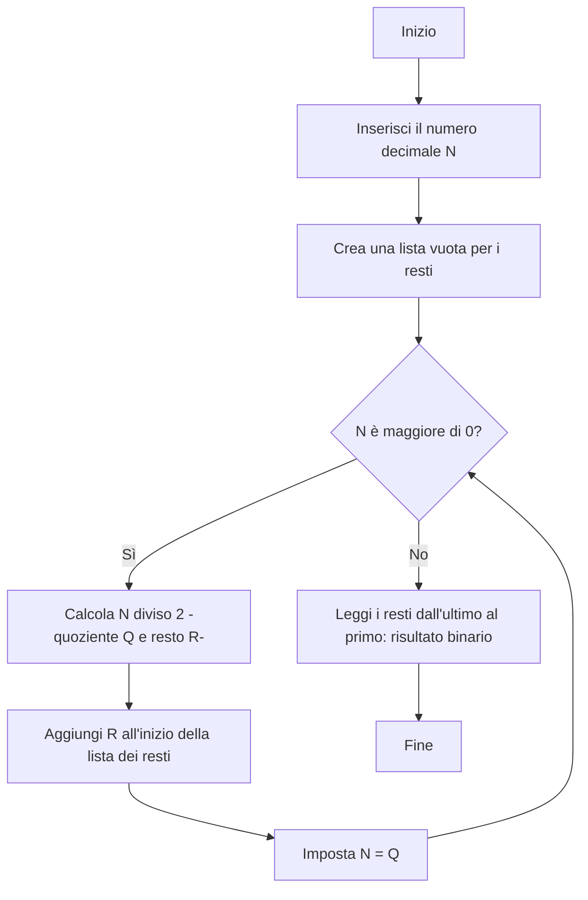

Certamente. Ho riorganizzato e unificato il contenuto del file, focalizzandomi sulla chiarezza degli algoritmi di conversione tra sistemi numerici (Decimale, Binario, Ottale, Esadecimale) e sul concetto fondamentale del **Complemento a Due** per la rappresentazione dei numeri negativi.

Ho rimosso le interazioni tra studenti e Omarilli per creare un documento più strutturato e didattico, perfetto come risorsa di studio.

---

# Fondamenti di Sistemi di Numerazione e Rappresentazione Binaria

Comprendere come i numeri vengono rappresentati e convertiti tra diverse basi numeriche è essenziale per chiunque si avvicini all'informatica e all'elettronica. I computer utilizzano il sistema **binario** (base 2), il cui funzionamento logico di "acceso" (1) e "spento" (0) si adatta perfettamente ai circuiti digitali.

## I Sistemi di Numerazione

| Sistema | Base | Cifre Utilizzate | Note |
| :--- | :--- | :--- | :--- |
| **Decimale** | 10 | 0, 1, 2, 3, 4, 5, 6, 7, 8, 9 | Il sistema di uso quotidiano. |
| **Binario** | 2 | 0, 1 | Il linguaggio nativo dei computer. |
| **Ottale** | 8 | 0, 1, 2, 3, 4, 5, 6, 7 | Spesso usato come forma abbreviata del binario (3 bit per cifra). |
| **Esadecimale** | 16 | 0-9 e A, B, C, D, E, F | Spesso usato come forma abbreviata del binario (4 bit per cifra). |

---

## I. Algoritmi di Conversione Manuale

La conversione tra i sistemi numerici può avvenire con due metodi principali, a seconda della direzione della conversione.

### A. Conversione da Base $N$ (Binario, Ottale, Esadecimale) a Decimale

Questo metodo si basa sulla somma dei valori posizionali.

| Sistema di Partenza | Metodo |
| :--- | :--- |
| **Binario** | **Metodo delle Potenze di 2**: Moltiplica ogni cifra per la potenza di $2$ corrispondente alla sua posizione (partendo da $2^0$ a destra) e somma i risultati. |

**Esempio (Binario a Decimale):** Convertire $1101_2$
$$(1 \times 2^3) + (1 \times 2^2) + (0 \times 2^1) + (1 \times 2^0) = 8 + 4 + 0 + 1 = 13_{10}$$

### B. Conversione da Decimale a Base $N$ (Binario, Ottale, Esadecimale)

Questo metodo si basa sul concetto delle divisioni successive per la nuova base.

| Sistema di Arrivo | Metodo |
| :--- | :--- |
| **Binario** | **Divisione Successiva per 2**: Dividi il decimale per 2 e annota il resto. Ripeti l'operazione con il quoziente finché non è zero. Il risultato è dato dai resti letti in ordine inverso (dal basso verso l'alto). |
| **Ottale** | **Divisione Successiva per 8**: Dividi il decimale per 8 e annota il resto. I resti letti in ordine inverso costituiscono il numero ottale. |
| **Esadecimale** | **Divisione Successiva per 16**: Dividi il decimale per 16 e annota il resto (i resti 10-15 sono A-F). I resti letti in ordine inverso costituiscono il numero esadecimale. |

**Esempio (Decimale a Binario):** Convertire $13_{10}$
* $13 \div 2 = 6$ resto $\textbf{1}$
* $6 \div 2 = 3$ resto $\textbf{0}$
* $3 \div 2 = 1$ resto $\textbf{1}$
* $1 \div 2 = 0$ resto $\textbf{1}$
Risultato (letti dal basso verso l'alto): $1101_2$

---

## II. Conversione Veloce Tramite Raggruppamento (Ottale e Esadecimale)

Per le conversioni tra Binario, Ottale ed Esadecimale, si usa il metodo del raggruppamento, che evita le lunghe divisioni.

### A. Conversione Binario $\longleftrightarrow$ Ottale (Gruppi di 3 Bit)

Poiché $2^3 = 8$, ogni cifra ottale corrisponde esattamente a un gruppo di 3 bit.

| Binario | Ottale |
| :--- | :--- |
| 000 | 0 |
| 001 | 1 |
| 010 | 2 |
| ... | ... |
| 111 | 7 |

**Esempio (Decimale $\to$ Ottale con 3 Bit):** Convertire $45_{10}$
1. Converti $45_{10}$ in binario: $\mathbf{101101}_2$
2. Raggruppa in gruppi di 3 bit da destra: $\mathbf{101}\ \mathbf{101}$
3. Converti ogni gruppo in ottale: $101 \to 5$, $101 \to 5$
Risultato: $55_8$

### B. Conversione Binario $\longleftrightarrow$ Esadecimale (Gruppi di 4 Bit)

Poiché $2^4 = 16$, ogni cifra esadecimale corrisponde esattamente a un gruppo di 4 bit.

| Binario | Esadecimale | Binario | Esadecimale |
| :--- | :--- | :--- | :--- |
| 0000 | 0 | 1000 | 8 |
| 0001 | 1 | 1001 | 9 |
| 0010 | 2 | 1010 | A (10) |
| ... | ... | 1111 | F (15) |

**Esempio (Decimale $\to$ Esadecimale con 4 Bit):** Convertire $123_{10}$
1. Converti $123_{10}$ in binario: $\mathbf{1111011}_2$
2. Raggruppa in gruppi di 4 bit da destra (aggiungendo uno 0 a sinistra): $\mathbf{0111}\ \mathbf{1011}$
3. Converti ogni gruppo in esadecimale: $0111 \to 7$, $1011 \to B$
Risultato: $7B_{16}$

---

## III. Il Complemento a Due: Numeri Negativi

Nei sistemi digitali (come la CPU di un computer), i numeri negativi vengono rappresentati utilizzando il metodo del **Complemento a Due**. Questo metodo permette di eseguire sottrazioni semplicemente sommando, semplificando la progettazione dei circuiti.

### Rappresentazione su un Byte (8 Bit)

Con un byte, si possono rappresentare $2^8 = 256$ valori.
* **Senza segno (Unsigned):** Da $0$ a $255$.
* **Con segno (Signed, Complemento a Due):** Da $-128$ a $+127$.

Il **Bit più Significativo (MSB)**, quello più a sinistra, funge da **Bit di Segno**:
* **0** $\to$ Numero **Positivo**
* **1** $\to$ Numero **Negativo**

### Calcolo del Complemento a Due per un Numero Negativo

Per trovare la rappresentazione in Complemento a Due di un numero negativo (ad esempio, $-5$ su 8 bit):

1.  **Trova la rappresentazione binaria del numero positivo** (5): $\mathbf{00000101}$
2.  **Inverti tutti i bit** (Complemento a Uno): $\mathbf{11111010}$
3.  **Aggiungi 1** al risultato: $\mathbf{11111010} + 1 = \mathbf{11111011}$

Quindi, $\mathbf{11111011}$ è la rappresentazione binaria di $-5$ in Complemento a Due.

### Vantaggi

Il grande vantaggio è che la sottrazione $A - B$ diventa un'addizione $A + (-B)$, dove $-B$ è la rappresentazione in Complemento a Due di $B$. L'eventuale riporto (overflow) fuori dal byte viene semplicemente ignorato.

**Esempio: $10 - 5$ (ovvero $10 + (-5)$)**
$$
\begin{array}{l r}
\text{10} & \mathbf{00001010} \\
\text{-5} & \mathbf{11111011} \\
\hline
\text{Somma} & (1)\mathbf{00000101}
\end{array}
$$
Il risultato è $\mathbf{00000101}$, che è $5_{10}$. Il riporto tra parentesi (1) viene scartato.

---

## IV. Diagrammi di Flusso degli Algoritmi Manuali

I seguenti diagrammi rappresentano in modo logico e sequenziale i passaggi necessari per la conversione.

### Diagramma di Flusso: Da Decimale a Binario (Divisioni Successive per 2)



### Diagramma di Flusso: Da Binario a Decimale (Potenze di 2)

```mermaid
graph TD
    A[Inizio] --> B[Inserisci il numero binario (es. 1101)];
    B --> C[Imposta il valore decimale = 0];
    C --> D[Imposta la potenza di 2 corrente = 1 (2^0)];
    D --> E[Prendi la cifra (bit) più a destra del numero binario];
    E --> F{Hai processato tutte le cifre?};
    F -- Sì --> J[Il valore decimale è il risultato];
    F -- No --> G[Se il bit è 1: aggiungi la potenza di 2 corrente al valore decimale];
    G --> H[Rimuovi la cifra processata dal binario];
    H --> I[Moltiplica la potenza di 2 corrente per 2];
    I --> E;
    J --> K[Fine];
```