```mermaid

graph TD
    A[Inizio] --> B[Inserisci il numero binario  es. 1101 ];
    B --> C[Imposta il valore decimale = 0];
    C --> D[Imposta la potenza di 2 corrente = 1 - corrisponde a 2^0];
    D --> E[Prendi la cifra bit più a destra del numero binario];
    E --> F{Hai processato tutte le cifre del numero binario?};
    F -- Sì --> J[Il valore decimale è il risultato];
    F -- No --> G[Se la cifra o bit è 1: aggiungi la potenza di 2 corrente al valore decimale];
    G --> H[Rimuovi la cifra processata dal numero binario];
    H --> I[Moltiplica la potenza di 2 corrente per 2 -per ottenere la prossima potenza di 2- ];
    I --> E;
    J --> K[Fine];

```

Capire come trasformare i numeri da decimale a binario e viceversa, e saperlo fare "a mano", è fondamentale per diverse ragioni, specialmente se siete interessati al mondo della tecnologia e dell'informatica.

### L'Importanza della Conversione Decimale-Binario (e Viceversa)

1.  **Il Linguaggio dei Computer:**
    * **I computer parlano in binario:** La ragione principale è che i computer, a livello più basso, funzionano con l'elettricità. Un segnale elettrico può essere "acceso" (rappresentato da 1) o "spento" (rappresentato da 0). Questo sistema a due stati è perfettamente rappresentato dal sistema numerico binario (base 2), che usa solo le cifre 0 e 1.
    * **Tutto è binario:** Quando usate il vostro smartphone, guardate un video, scrivete un messaggio o giocate a un videogioco, tutte le informazioni (testo, immagini, suoni, istruzioni) vengono convertite in sequenze di 0 e 1 per essere elaborate dal processore. Saper convertire vi dà un'idea di come questi dati vengono "capiti" dalla macchina.

2.  **Comprendere l'Hardware:**
    * **Circuiti Digitali:** La logica alla base dei circuiti elettronici (come quelli dentro un microprocessore) è costruita su porte logiche (AND, OR, NOT) che operano con valori binari (vero/falso, 1/0). Capire il binario vi aiuta a capire come questi circuiti elaborano le informazioni.
    * **Memoria:** La memoria dei computer (RAM, hard disk, chiavette USB) memorizza i dati sotto forma di bit (0 o 1). Comprendere come i numeri decimali vengono tradotti in sequenze di bit vi aiuta a capire come le informazioni sono immagazzinate.

3.  **Programmazione e Reti:**
    * **Livello Basso (Assembly, C):** Se mai vi avvicinerete alla programmazione a basso livello (come il linguaggio Assembly o il C per alcuni aspetti), vi imbatterete direttamente in valori binari o esadecimali (che sono una scorciatoia per il binario).
    * **Indirizzi IP:** Nel networking, gli indirizzi IP (come 192.168.1.1) sono spesso pensati in notazione decimale, ma in realtà sono composti da 32 o 128 bit. Saperli convertire in binario è fondamentale per capire le subnet mask e il funzionamento delle reti.
    * **Codifica dei Dati:** Dalla codifica dei colori (RGB) alla rappresentazione dei caratteri (ASCII, Unicode), molti schemi di codifica si basano su rappresentazioni binarie.

4.  **Sviluppo del Pensiero Logico e Matematico:**
    * **Basi Numeriche:** Capire il binario (e altri sistemi come l'ottale e l'esadecimale) rafforza la comprensione del concetto di "base" in un sistema numerico posizionale, che è fondamentale in matematica.
    * **Problem Solving:** Implementare gli algoritmi manualmente richiede precisione, attenzione ai dettagli e un approccio sistematico, abilità utili in ogni campo.

### Implementare gli Algoritmi di Conversione Manualmente: Perché è Importante

Anche se esistono calcolatrici e strumenti online che fanno la conversione per voi, saperla fare a mano è cruciale per:

1.  **Comprensione Profonda:** Eseguire l'algoritmo manualmente vi costringe a capire il "perché" dietro ogni passaggio, non solo il "come". Non state solo premendo un tasto, state costruendo attivamente il numero nel nuovo sistema.
2.  **Debugging e Risoluzione Problemi:** Se un programma o un calcolatore restituisce un risultato inaspettato, avere la capacità di fare la conversione a mano vi permette di verificare i calcoli e identificare potenziali errori.
3.  **Fondamenta Solide:** È come imparare a fare le operazioni matematiche base prima di usare la calcolatrice. Costruisce una base solida di conoscenza che vi servirà per concetti più complessi in informatica.
4.  **Ragionamento Algoritmico:** Gli algoritmi di conversione sono semplici ma efficaci esempi di algoritmi. Impararli a mano aiuta a sviluppare il pensiero algoritmico: la capacità di scomporre un problema in passi logici e sequential.

### Gli Algoritmi Manuali

#### 1. Da Decimale a Binario (Metodo delle Divisioni Successive per 2)

Questo è l'algoritmo che si usa più frequentemente:

**Passaggi:**
1.  Dividi il numero decimale per 2.
2.  Annota il resto (che sarà sempre 0 o 1).
3.  Usa il quoziente ottenuto come nuovo numero da dividere.
4.  Ripeti i passaggi 1-3 finché il quoziente non diventa 0.
5.  Il numero binario si ottiene leggendo i resti dal basso verso l'alto (dall'ultimo resto al primo).

**Esempio: Convertire 13 in binario**

* $13 \div 2 = 6$ con resto $\textbf{1}$
* $6 \div 2 = 3$ con resto $\textbf{0}$
* $3 \div 2 = 1$ con resto $\textbf{1}$
* $1 \div 2 = 0$ con resto $\textbf{1}$

Leggendo i resti dal basso verso l'alto: $\textbf{1101}_2$.
Quindi, $13_{10} = 1101_2$.

#### 2. Da Binario a Decimale (Metodo delle Potenze di 2)

**Passaggi:**
1.  Scrivi il numero binario.
2.  Assegna a ciascuna cifra (bit) del numero binario una potenza di 2, partendo da $2^0$ per la cifra più a destra (meno significativa) e aumentando l'esponente di 1 per ogni posizione verso sinistra.
3.  Moltiplica ogni cifra binaria per la sua corrispondente potenza di 2.
4.  Somma tutti i risultati ottenuti.

**Esempio: Convertire 1101 in decimale**

* $1 \times 2^3$ (per la cifra più a sinistra)
* $1 \times 2^2$
* $0 \times 2^1$
* $1 \times 2^0$ (per la cifra più a destra)

Calcoli:
* $1 \times 8 = 8$
* $1 \times 4 = 4$
* $0 \times 2 = 0$
* $1 \times 1 = 1$

Somma i risultati: $8 + 4 + 0 + 1 = 13$.
Quindi, $1101_2 = 13_{10}$.

Imparare questi algoritmi e metterli in pratica manualmente è un passo fondamentale per chiunque voglia addentrarsi nel mondo dell'informatica, del coding o dell'elettronica. Vi fornisce non solo una conoscenza tecnica, ma anche una mentalità analitica e di problem-solving preziosa.

## Diagramma di Flusso: Conversione da Decimale a Binario

Questo algoritmo usa il metodo delle divisioni successive per 2.


   
## Spiegazione del Flusso:

    Inizio: Si parte.

    Inserisci il numero decimale N: Qui inserisci il numero decimale che vuoi convertire (es. 13).

    Crea una lista vuota per i resti: Prepara un posto dove salverai i resti (es. []).

    È N maggiore di 0?: Questa è una decisione.

        Sì: Se N è ancora maggiore di 0, continuiamo a dividere.

        No: Se N è diventato 0, abbiamo finito di dividere.

        Continua con N=6: 6div2=3 (Q) con resto 0 (R). Lista: [0, 1]. N diventa 3.

        Continua con N=3: 3div2=1 (Q) con resto 1 (R). Lista: [1, 0, 1]. N diventa 1.

        Continua con N=1: 1div2=0 (Q) con resto 1 (R). Lista: [1, 1, 0, 1]. N diventa 0.

    È N maggiore di 0? -- No: Ora N è 0, quindi ci fermiamo.

    Leggi i resti dall'ultimo al primo: questo è il numero binario: Prendi la lista dei resti nell'ordine in cui li hai aggiunti.

        Esempio: [1, 1, 0, 1] è il numero binario.

    Fine: L'algoritmo termina.

Diagramma di Flusso: Conversione da Binario a Decimale

Questo algoritmo usa il metodo delle potenze di 2.



## Spiegazione del Flusso:

    Inizio: Si parte.

    Inserisci il numero binario (es. 1101): Qui inserisci il numero binario che vuoi convertire.

    Imposta il valore decimale = 0: Questa variabile conterrà il risultato finale.

    Imposta la potenza di 2 corrente = 1 (corrisponde a 2^0): Iniziamo dalla potenza più bassa.

    Prendi la cifra (bit) più a destra del numero binario: Iniziamo dal bit meno significativo.

        Esempio: Se il numero è 1101, prendi 1.

    Hai processato tutte le cifre del numero binario?: Questa è una decisione.

        Sì: Se non ci sono più cifre da elaborare, abbiamo finito.

        No: Se ci sono ancora cifre, continuiamo.

    Se la cifra (bit) è 1: aggiungi la potenza di 2 corrente al valore decimale: Se il bit è 0, non aggiungiamo nulla. Se è 1, aggiungiamo il valore posizionale.

        Esempio: Per 1101, la prima cifra a destra è 1. Potenza di 2 corrente è 1. Quindi, valore_decimale = 0 + 1 = 1.

    Rimuovi la cifra processata dal numero binario: Il numero binario si accorcia.

        Esempio: 1101 diventa 110.

    Moltiplica la potenza di 2 corrente per 2: Passiamo alla potenza successiva.

        Esempio: La potenza di 2 corrente diventa 1times2=2.

    Torna al passo "Prendi la cifra (bit) più a destra...": Il ciclo si ripete.

        Continua con 110, prendi 0. Potenza di 2 corrente 2. 0times2=0. valore_decimale resta 1. Potenza di 2 diventa 4. Numero diventa 11.

        Continua con 11, prendi 1. Potenza di 2 corrente 4. valore_decimale = 1 + 4 = 5. Potenza di 2 diventa 8. Numero diventa 1.

        Continua con 1, prendi 1. Potenza di 2 corrente 8. valore_decimale = 5 + 8 = 13. Potenza di 2 diventa 16. Numero diventa vuoto.

    Hai processato tutte le cifre? -- Sì: Il numero binario è ora vuoto.

    Il valore decimale è il risultato: Il valore_decimale (13 nell'esempio) è il risultato finale.

    Fine: L'algoritmo termina.
    Calcola N diviso 2 (quoziente Q e resto R): Esegui la divisione.

        Esempio: Se N=13: 13div2=6 (Q) con resto 1 (R).

    Aggiungi R all'inizio della lista dei resti: Il resto è fondamentale. Lo aggiungi all'inizio perché poi lo leggerai dal basso verso l'alto.

        Esempio: Lista diventa [1] (per il primo resto di 13 diviso 2).

    Imposta N = Q: Il quoziente diventa il nuovo numero da dividere.

        Esempio: N diventa 6.

    Torna al passo "È N maggiore di 0?": Il ciclo si ripete.

        Continua con N=6: 6div2=3 (Q) con resto 0 (R). Lista: [0, 1]. N diventa 3.

        Continua con N=3: 3div2=1 (Q) con resto 1 (R). Lista: [1, 0, 1]. N diventa 1.

        Continua con N=1: 1div2=0 (Q) con resto 1 (R). Lista: [1, 1, 0, 1]. N diventa 0.

    È N maggiore di 0? -- No: Ora N è 0, quindi ci fermiamo.

    Leggi i resti dall'ultimo al primo: questo è il numero binario: Prendi la lista dei resti nell'ordine in cui li hai aggiunti.

        Esempio: [1, 1, 0, 1] è il numero binario.

    Fine: L'algoritmo termina.

Diagramma di Flusso: Conversione da Binario a Decimale

Questo algoritmo usa il metodo delle potenze di 2.


## Spiegazione del Flusso:

    Inizio: Si parte.

    Inserisci il numero binario (es. 1101): Qui inserisci il numero binario che vuoi convertire.

    Imposta il valore decimale = 0: Questa variabile conterrà il risultato finale.

    Imposta la potenza di 2 corrente = 1 (corrisponde a 2^0): Iniziamo dalla potenza più bassa.

    Prendi la cifra (bit) più a destra del numero binario: Iniziamo dal bit meno significativo.

        Esempio: Se il numero è 1101, prendi 1.

    Hai processato tutte le cifre del numero binario?: Questa è una decisione.

        Sì: Se non ci sono più cifre da elaborare, abbiamo finito.

        No: Se ci sono ancora cifre, continuiamo.

    Se la cifra (bit) è 1: aggiungi la potenza di 2 corrente al valore decimale: Se il bit è 0, non aggiungiamo nulla. Se è 1, aggiungiamo il valore posizionale.

        Esempio: Per 1101, la prima cifra a destra è 1. Potenza di 2 corrente è 1. Quindi, valore_decimale = 0 + 1 = 1.

    Rimuovi la cifra processata dal numero binario: Il numero binario si accorcia.

        Esempio: 1101 diventa 110.

    Moltiplica la potenza di 2 corrente per 2: Passiamo alla potenza successiva.

        Esempio: La potenza di 2 corrente diventa 1times2=2.

    Torna al passo "Prendi la cifra (bit) più a destra...": Il ciclo si ripete.

        Continua con 110, prendi 0. Potenza di 2 corrente 2. 0times2=0. valore_decimale resta 1. Potenza di 2 diventa 4. Numero diventa 11.

        Continua con 11, prendi 1. Potenza di 2 corrente 4. valore_decimale = 1 + 4 = 5. Potenza di 2 diventa 8. Numero diventa 1.

        Continua con 1, prendi 1. Potenza di 2 corrente 8. valore_decimale = 5 + 8 = 13. Potenza di 2 diventa 16. Numero diventa vuoto.

    Hai processato tutte le cifre? -- Sì: Il numero binario è ora vuoto.

    Il valore decimale è il risultato: Il valore_decimale (13 nell'esempio) è il risultato finale.

    Fine: L'algoritmo termina.

</div>

<style>
.scrollable {
  max-height: 300px; /* Altezza massima dell'area scrollabile */
  overflow-y: auto;  /* Abilita lo scroll verticale */
  padding: 1em;      /* Aggiungi un po' di padding */
  border: 1px solid #ccc; /* Aggiungi un bordo per evidenziare l'area scrollabile */
  width: 100%; /* Sfrutta la massima larghezza disponibile */
  box-sizing: border-box; /* Include padding e bordo nella larghezza totale */

}
</style>

---
layout: cover
level: 3
title: Welcome

---

### 🧑‍🎓 Studente- 6

## Capisco, quindi ogni posizione del bit in un numero binario rappresenta una potenza crescente di 2. Questo significa che più bit utilizziamo, più grande può essere il numero che possiamo rappresentare. Ma perché i computer usano il sistema binario? 🤔

---
layout: cover
level: 3
title: Welcome

---

### 🧠  Omarillo 12

## Esatto! I computer usano il sistema binario perché è semplice ed efficiente per i circuiti elettronici. Nei circuiti digitali, è molto più facile rappresentare due stati distinti, come acceso e spento, o alta e bassa tensione, piuttosto che dieci stati diversi. Questo rende il sistema binario ideale per l'elaborazione e la memorizzazione dei dati. 💡

---
layout: cover
level: 3
title: Welcome

---

### 🧑‍🎓 Studente-5

## Ha senso. I computer possono quindi usare questi due stati per rappresentare 0 e 1, e combinandoli, possono eseguire operazioni complesse. Come si eseguono le operazioni matematiche di base, come l'addizione, nel sistema binario? ➕🧮

---
layout: cover
level: 3
title: Welcome

---

### 🧠 Omarillo-10

## Ottima domanda! Le operazioni matematiche di base nel sistema binario seguono regole semplici. Vediamo l'addizione come esempio:

- 0 + 0 = 0
- 0 + 1 = 1
- 1 + 0 = 1
- 1 + 1 = 10 (che è 0 con riporto 1, proprio come 9 + 1 fa 10 in decimale)

Quindi, se aggiungiamo i numeri binari 101 e 011, otteniamo:

```
  101
+ 011
-----
 1000
```

Abbiamo un riporto nella seconda colonna da destra, proprio come nell'addizione decimale. 🚀

---
layout: cover
level: 3
title: Welcome

---

### 🧑‍🎓 Studente-1

## Interessante! E cosa succede con le altre operazioni, come la sottrazione o la moltiplicazione? 🔍

---
layout: cover
level: 3
title: Welcome

---

### 🧠 Omarillo-11

### La sottrazione nel sistema binario utilizza un concetto simile al prestito nel sistema decimale. Ad esempio, per sottrarre 011 da 101:

```text
  101
- 011
-----
  010
```

Per la moltiplicazione, il processo è simile alla moltiplicazione decimale ma utilizza solo 0 e 1. Moltiplicare binari è come fare una serie di addizioni shiftate. Ad esempio, per moltiplicare 101 per 11:

```
   101
×   11
-------
   101
+ 1010  (shiftato a sinistra di una posizione)
-------
 1111
```

Il risultato è 1111, che è 15 in decimale. 💻

---
layout: cover
level: 3
title: Welcome

---

### 🧑‍🎓 Studente-12

## Fantastico! Quindi le operazioni nel sistema binario seguono logiche simili a quelle del sistema decimale, ma con regole adattate ai due stati possibili. Ci sono altri aspetti importanti del sistema binario che dovrei conoscere? 📘

---
layout: cover
level: 3
title: Welcome

---

### 🧠 Omarillo-9

## Sì, ci sono alcuni concetti chiave come i complementi a 1 e a 2, che sono usati per rappresentare i numeri negativi e per facilitare le operazioni aritmetiche nei computer. Il complemento a 2, in particolare, è molto usato perché semplifica l'implementazione dell'addizione e della sottrazione dei numeri binari. 🎲🔢

---
layout: cover
level: 3
title: Welcome

---

### 🧑‍🎓 Studente-2

## Interessante! Quindi il sistema binario ha molte applicazioni pratiche nei computer e nei sistemi digitali. Grazie, professore, per questa spiegazione dettagliata. Ora ho una comprensione molto migliore di come funziona il sistema binario! 😊

---
layout: cover
level: 3
title: Welcome

---

### 🧠 Omarillo-7

## Sono felice che tu abbia trovato utile la spiegazione! Continua a esplorare e a fare domande. Il sistema binario è la base di tutto il calcolo digitale, e comprendere come funziona ti aprirà molte porte nel mondo della tecnologia. 🌐🚀

## Lo sai che dovrai dimostrare di sapere come convertire i numeri tra i vari sistemi di numerazione: decimale, binario, ottale ed esadecimale.

## Sicuramente c'è un Omarillo che ti aiuterà in questo compito. Ma tu sei pronto?

---
layout: cover
level: 3
title: Welcome

---

### 🧑‍🎓 Studente-4

## Prontissimo! Grazie,
# Omarilli. Da dove iniziamo?

---
layout: cover
level: 3
title: Welcome

---

### 🧠 Omarillo-5

## Iniziamo sempre con le basi. Ecco una panoramica degli algoritmi di conversione tra i vari sistemi di numerazione.

### 1. Conversione da Decimale a Binario

### Passaggi:
1. **Divisione successiva per 2**: Dividi il numero decimale per 2.
2. **Resto**: Annota il resto (0 o 1).
3. **Quoziente**: Usa il quoziente ottenuto come nuovo numero da dividere.
4. **Ripeti**: Continua fino a ottenere un quoziente di 0.
5. **Lettura inversa**: I resti letti dall'ultima divisione alla prima costituiscono il numero binario.

---
layout: cover
level: 3
title: Welcome

---

### 🧠 Omarillo-6

### E poi con un esempio:

Convertiamo il numero decimale 13 in binario:

1. 13 ÷ 2 = 6 resto 1
2. 6 ÷ 2 = 3 resto 0
3. 3 ÷ 2 = 1 resto 1
4. 1 ÷ 2 = 0 resto 1

Leggendo i resti al contrario, otteniamo: **1101**.

Ed infine con una [app guida](http://fabrizio.phpnet.us/Sistemi_di_numerazione/sdn.html)
---
layout: cover
level: 3
title: Welcome

---

### 🧑‍🎓 Studente-6

## Capito! E per la conversione da decimale a ottale?

---
layout: cover
level: 3
title: Welcome

---

### 🧠 Omarillo-3

## Bene, passiamo alla conversione da Decimale a Ottale.

### 2. Conversione da Decimale a Ottale

### Passaggi:
1. **Divisione successiva per 8**: Dividi il numero decimale per 8.
2. **Resto**: Annota il resto (tra 0 e 7).
3. **Quoziente**: Usa il quoziente ottenuto come nuovo numero da dividere.
4. **Ripeti**: Continua fino a ottenere un quoziente di 0.
5. **Lettura inversa**: I resti letti dall'ultima divisione alla prima costituiscono il numero ottale.

---
layout: cover
level: 3
title: Welcome

---

### 🧠 Omarillo-1

## A seguire ... Esempio:

Convertiamo il numero decimale 83 in ottale:

1. 83 ÷ 8 = 10 resto 3
2. 10 ÷ 8 = 1 resto 2
3. 1 ÷ 8 = 0 resto 1

Leggendo i resti al contrario, otteniamo: **123**.

---
layout: cover
level: 3
title: Welcome

---

### 🧑‍🎓 Studente-8.

## Chiaro! E come faccio a convertire da decimale a esadecimale?

---
layout: cover
level: 3
title: Welcome

---

### 🧠 Omarillo-12.

## Ottima domanda! Ecco come convertire da Decimale a Esadecimale.

### 3. Conversione da Decimale a Esadecimale

### Passaggi:

1. **Divisione successiva per 16**: Dividi il numero decimale per 16.
2. **Resto**: Annota il resto (tra 0 e 15; per valori da 10 a 15, usa le lettere A-F).
3. **Quoziente**: Usa il quoziente ottenuto come nuovo numero da dividere.
4. **Ripeti**: Continua fino a ottenere un quoziente di 0.
5. **Lettura inversa**: I resti letti dall'ultima divisione alla prima costituiscono il numero esadecimale.

---
layout: cover
level: 3
title: Welcome

---

### 🧠 Omarillo-10.

## Allego Esempio:

Convertiamo il numero decimale 255 in esadecimale:

1. 255 ÷ 16 = 15 resto 15 (F)
2. 15 ÷ 16 = 0 resto 15 (F)

Leggendo i resti al contrario, otteniamo: **FF**.

---
layout: cover
level: 3
title: Welcome

---

### 🧑‍🎓 Studente-5.

## Perfetto! E se volessi convertire da binario a decimale?

---
layout: cover
level: 3
title: Welcome

---

### 🧠 Omarillo-8.

## Certo! Vediamo come fare la conversione da Binario a Decimale.

### 4. Conversione da Binario a Decimale

### Passaggi

1. **Posizione dei bit**: Ogni bit ha un valore basato sulla sua posizione (da destra a sinistra): 2^0, 2^1, 2^2, etc.
2. **Somma dei valori**: Moltiplica ogni bit per il suo valore di posizione e somma tutti i risultati.

---
layout: cover
level: 3
title: Welcome

---

### 🧠 Omarillo-6.

## sempre Esempio:

Convertiamo il numero binario 1101 in decimale:

1. (1 * 2^3) + (1 * 2^2) + (0 * 2^1) + (1 * 2^0)
2. = (1 * 8) + (1 * 4) + (0 * 2) + (1 * 1)
3. = 8 + 4 + 0 + 1
4. = 13

---
layout: cover
level: 3
title: Welcome

---

### 🧑‍🎓 Studente-7.

## Grazie, Omarillo! Ora ho capito come fare tutte queste conversioni. Posso praticarle da solo per migliorare.

---
layout: cover
level: 3
title: Welcome

---

### 🧠 Omarillo-2.

## Ottimo lavoro, Studente! Continuate a esercitarvi e a esplorare questi concetti. La pratica rende perfetti!

## Omarilli, siamo stati di grande aiuto, ma poichè la prova è saper applicare gli algoritmi di conversione senza la calcolatrice, potremmo spiegare come utilizzare la tabella a 3 e 4 bit per le conversioni da decimale a ottale ed esadecimale evitando così di dover far loro dividere manualmente per 8 o per 16 ?

---
layout: cover
level: 3
title: Welcome

---

### 🧠 Omarillo-4 - Neurone di Intelligenza Naturale

## Certo, probabilmente per loro sarà complicato!

### ALLORA Inizierei con le tabelle di conversione a 3 bit per l'ottale e a 4 bit per l'esadecimale. Queste tabelle ci aiutano a convertire rapidamente tra i vari sistemi di numerazione.

### Tabella di Conversione a 3 Bit (Ottale)

### 3 Bit -> Ottale
```
Binario  | Ottale
---------|-------
000      | 0
001      | 1
010      | 2
011      | 3
100      | 4
101      | 5
110      | 6
111      | 7
```

---
layout: cover
level: 3
title: Welcome

---

### 🧠 Omarillo-1

## Esempio di Conversione da Decimale a Ottale

Convertiamo il numero decimale 25 in ottale utilizzando i 3 bit:

1. **Passo 1**: Converti il numero decimale in binario.
   - 25 in binario è 11001.
2. **Passo 2**: Raggruppa i bit in gruppi di 3, partendo da destra. Aggiungi zeri a sinistra se necessario.
   - 11001 diventa 011 001.
3. **Passo 3**: Usa la tabella per convertire ogni gruppo di 3 bit in ottale.
   - 011 diventa 3, e 001 diventa 1.
4. **Risultato**: 25 in ottale è **31**.

---
layout: cover
level: 3
title: Welcome

---

### 🧠 Omarillo-12

## Ottimo! Ora vediamo come fare la conversione in esadecimale usando la tabella a 4 bit.

---
layout: cover
level: 3
title: Welcome

---

### 🧠 Omarillo-2

## Ecco la tabella di conversione a 4 bit per l'esadecimale.

### Tabella di Conversione a 4 Bit (Esadecimale)

### 4 Bit -> Esadecimale
```
Binario  | Esadecimale|Binario  | Esadecimale
---------|------------|---------|------------
0000     | 0          |1000     | 8
0001     | 1          |1001     | 9
0010     | 2          |1010     | A (10)
0011     | 3          |1011     | B (11)
0100     | 4          |1100     | C (12)
0101     | 5          |1101     | D (13)
0110     | 6          |1110     | E (14)
0111     | 7          |1111     | F (15) 
```

---
layout: cover
level: 3
title: Welcome

---

### 🧠 Omarillo-12

## Esempio di Conversione da Decimale a Esadecimale

Convertiamo il numero decimale 255 in esadecimale utilizzando i 4 bit:

1. **Passo 1**: Converti il numero decimale in binario.
   - 255 in binario è 11111111.
2. **Passo 2**: Raggruppa i bit in gruppi di 4, partendo da destra. Aggiungi zeri a sinistra se necessario.
   - 11111111 diventa 1111 1111.
3. **Passo 3**: Usa la tabella per convertire ogni gruppo di 4 bit in esadecimale.
   - 1111 diventa F, e 1111 diventa F.
4. **Risultato**: 255 in esadecimale è **FF**.

---
layout: cover
level: 3
title: Welcome

---

### 🧑‍🏫 Professore

## Ben fatto, Omarilli! Studenti, avete domande su queste conversioni?
Metodi di Conversione tra Sistemi di Numerazione

---
layout: cover
level: 3
title: Welcome

---

### 🧑‍🎓 Studente-9

## Omarillo, potresti fare un altro esempio di conversione da decimale a ottale e uno da decimale a esadecimale?

---
layout: cover
level: 3
title: Welcome

---

### 🧠 Omarillo-9

## Con piacere! Facciamo un altro esempio per ciascuna conversione.

### Conversione da Decimale a Ottale

Convertiamo il numero decimale 45 in ottale:

1. **Passo 1**: Converti il numero decimale in binario.
   - 45 in binario è 101101.
2. **Passo 2**: Raggruppa i bit in gruppi di 3, partendo da destra.
   - 101101 diventa 101 101.
3. **Passo 3**: Usa la tabella per convertire ogni gruppo di 3 bit in ottale.
   - 101 diventa 5, e 101 diventa 5.
4. **Risultato**: 45 in ottale è **55**.

---
layout: cover
level: 3
title: Welcome

---

### 🧠 Omarillo-4

### Conversione da Decimale a Esadecimale

Convertiamo il numero decimale 123 in esadecimale:

1. **Passo 1**: Converti il numero decimale in binario.
   - 123 in binario è 1111011.
2. **Passo 2**: Raggruppa i bit in gruppi di 4, partendo da destra.
   - 01111011 diventa 0111 1011.
3. **Passo 3**: Usa la tabella per convertire ogni gruppo di 4 bit in esadecimale.
   - 0111 diventa 7, e 1011 diventa B.
4. **Risultato**: 123 in esadecimale è **7B**.

---
layout: cover
level: 3
title: Welcome

---

### 🧑‍🏫 Professore

## Ottimo lavoro, Omarillo! Ora, studenti, esercitatevi con il [simulatore](http://fabrizio.phpnet.us/Sistemi_di_numerazione/testdecbin.html) e fatemi sapere se avete altre domande.

---
layout: cover
level: 2
title: Complemento a 2
---

### 🧑‍🎓 Studente-1 (curioso)  

"Ho sentito parlare di complemento a due per rappresentare i numeri negativi, ma non capisco come funziona su un byte. Potete spiegarcelo?"

### 🧠 Omarillo-1 (con tono entusiasta)

"Assolutamente! Il **complemento a due** è un metodo usato per rappresentare i numeri negativi nel sistema binario. E funziona perfettamente con un byte, che è composto da 8 bit. Pronti a scoprire come funziona?"

---
layout: cover
level: 3
title: Complemento a 2

---

### 🧑‍🎓 Studente-2 (interessato):

"Un byte ha 8 bit, giusto? Quindi può rappresentare 256 valori, da 0 a 255?"

### 🧠 Omarillo-2 (confermando)

"Esatto! Ma quando usiamo il complemento a due, metà di quei valori rappresenta i numeri negativi. Invece di andare da 0 a 255, possiamo rappresentare i numeri da -128 a +127."

---
layout: cover
level: 3
title: Complemento a 2

---

### 🧑‍🎓 Studente-3 (pensando)

"Ma come possiamo avere numeri negativi con solo 0 e 1? Non c'è un segno meno..."

### 🧠 Omarillo-3 (sorridendo)

"È qui che entra in gioco il trucco! Usiamo l'**ultimo bit** del byte come **bit di segno**. Se il bit più significativo (quello a sinistra) è **0**, il numero è positivo. Se è **1**, è negativo. Ad esempio, il numero positivo 5 in binario è `00000101`."

---
layout: cover
level: 3
title: Complemento a 2

---

### 🧑‍🎓 Studente-4 (esaminando il codice binario)

"E se fosse negativo? Come si rappresenta -5?"

### 🧠 Omarillo-4 (spiegando)

"Per rappresentare -5, usiamo il complemento a due. Si fa così:

1. **Prendi il numero positivo** (5 in questo caso): `00000101`.
2. **Inverti tutti i bit** (complemento a uno): `11111010`.
3. **Aggiungi 1** all'inversione: `11111011`.

Ecco, `11111011` è la rappresentazione binaria di -5 in complemento a due."

---
layout: cover
level: 3
title: Complemento a 2

---

### 🧑‍🎓 Studente-5 (perplesso)

"Quindi, ogni numero negativo si ottiene invertendo i bit e aggiungendo 1?"

### 🧠 Omarillo-5 (annuisce)

"Esatto! Questo metodo funziona per qualsiasi numero negativo. Il bit più a sinistra, che è 1, ci indica che il numero è negativo."

---
layout: cover
level: 3
title: Complemento a 2

---

### 🧑‍🎓 Studente-6 (riflette)

"Ok, ma come facciamo a capire che si tratta di -5 e non di qualche altro numero?"

### 🧠 Omarillo-6 (risponde)

"Beh, è facile! Quando vedi un numero binario con il bit più significativo a 1, sai che è un numero negativo. Puoi invertire il processo per capire quale numero rappresenta. Ecco come:

1. **Inizia con il numero binario negativo**: `11111011`.
2. **Inverti tutti i bit**: `00000100`.
3. **Aggiungi 1**: `00000101` (che è 5 in binario).

Quindi, `11111011` è -5!"


---
layout: cover
level: 3
title: Complemento a 2

---

### 🧑‍🎓 Studente-7 (sorpreso)

"Ah! Adesso capisco! Ma, se rappresentiamo i numeri negativi così, qual è il numero più grande e il più piccolo che possiamo rappresentare con un byte?"

### 🧠 Omarillo-7 (risponde con tono sicuro)

"Il numero più grande è `01111111`, che è +127 in decimale. Il più piccolo invece è `10000000`, che rappresenta -128 in decimale. Questo perché il bit più significativo è 1, e tutti gli altri sono 0."

---
layout: cover
level: 3
title: Complemento a 2

---

### 🧑‍🎓 Studente-8 (facendo i conti)

"Quindi, con un byte possiamo rappresentare numeri da -128 a +127, giusto?"

### 🧠 Omarillo-8 (conferma)

"Esattamente! Il complemento a due ti dà questa gamma di valori. E funziona anche per operazioni aritmetiche come la somma e la sottrazione, senza dover trattare i numeri positivi e negativi in modo diverso."

---
layout: cover
level: 3
title: Complemento a 2

---

### 🧑‍🎓 Studente-9 (con una domanda)

"Ok, ma come funziona la sottrazione? Se sommo -5 a un altro numero, cosa succede?"

### 🧠 Omarillo-9 (spiega pazientemente)

"La cosa geniale del complemento a due è che puoi fare le sottrazioni semplicemente sommando! Ad esempio, se vuoi fare 10 - 5, in realtà sommi 10 a -5. Vediamo:

1. **10** in binario è `00001010`.
2. **-5** in binario è `11111011`.

Ora sommiamo:

```
  00001010  (10)
+ 11111011  (-5)
-
  00000101  (5)
```

Il risultato è 5, che è corretto!"

---
layout: cover
level: 3
title: Complemento a 2

---

### 🧑‍🎓 Studente-10 (stupito)

"Wow, quindi non dobbiamo pensare troppo alla sottrazione! Basta sommare!"

### 🧠 Omarillo-10 (con tono allegro)

"Esattamente! È per questo che il complemento a due è così utile: semplifica i calcoli, specialmente nelle CPU."

---
layout: cover
level: 3
title: Complemento a 2

---

### 🧑‍🎓 Studente-11 (pensando a qualcosa di più pratico)

"Ma che succede se superiamo i limiti del byte, ad esempio se sommiamo qualcosa che dà più di +127 o meno di -128?"

### 🧠 Omarillo-11 (con tono serio)

"Questo è un punto importante! Quando superi i limiti, si verifica un **overflow**. Se sommi un numero che dà come risultato maggiore di 127 o minore di -128, il calcolo 'si ribalta'. Ad esempio, se provi a sommare 127 e 1, otterrai -128 perché l'overflow ha invertito il risultato."

---
layout: cover
level: 3
title: Complemento a 2

---

### 🧑‍🎓 Studente-12 (riflettendo)

"Quindi il complemento a due non è solo per rappresentare numeri negativi, ma rende anche più semplici le operazioni matematiche con i numeri binari?"

### 🧠 Omarillo-12 (conclusivo)

"Esatto! Il **complemento a due** è il metodo standard per rappresentare i numeri negativi nei sistemi digitali proprio perché rende le operazioni aritmetiche efficienti e coerenti. E ora che lo conosci, hai uno strumento fondamentale per capire come funzionano i computer e le CPU!"

---
layout: cover
level: 3
title: Complemento a 2

---

### 🧑‍🎓 Studente-1 (entusiasta)

"Grazie, Omarilli! Questo concetto mi era sempre sembrato complesso, ma ora tutto ha molto più senso!"

---